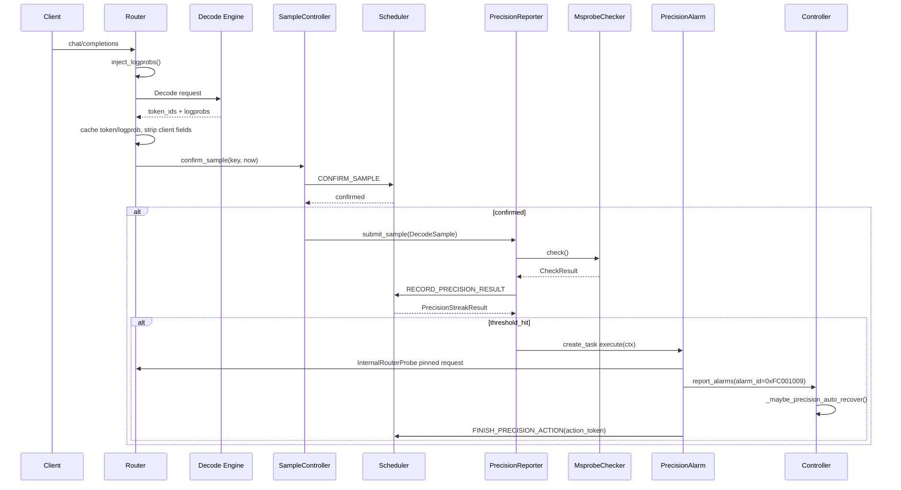
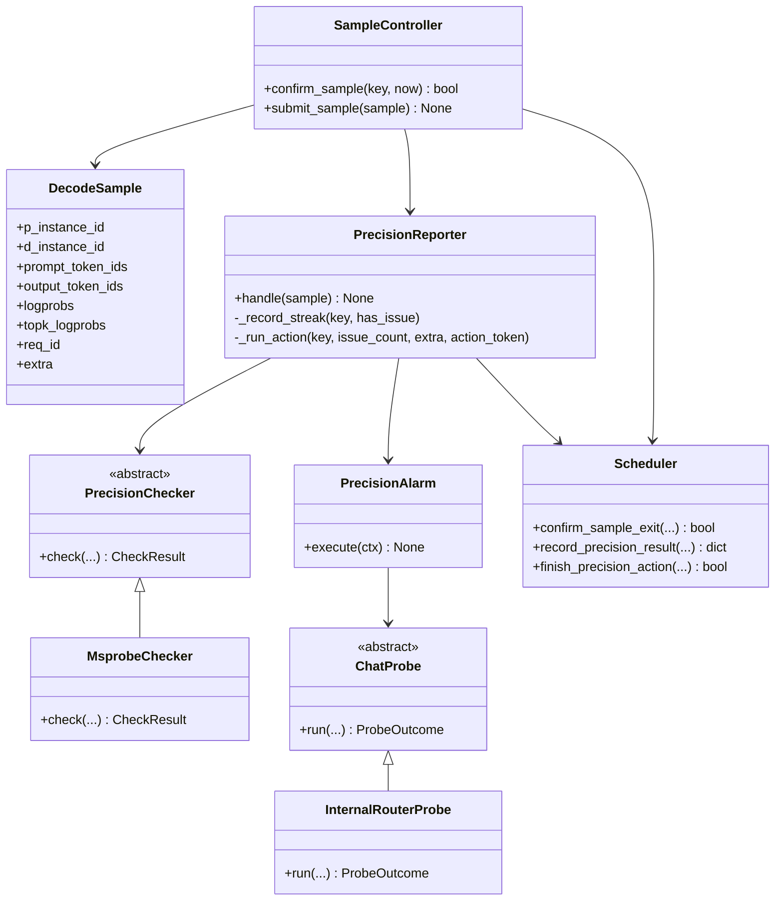

# 精度检测故障恢复特性

## 概述

精度检测故障恢复特性用于在 Coordinator 侧在线采集 Decode 输出 token 与 logprob，利用 msprobe 检测大段重复、乱码、生僻字等输出质量异常，并在连续异常达到阈值后通过固定问答拨测进行二次确认。确认后 Coordinator 上报 `alarm_id=0xFC001009` 的精度异常告警，Controller 可根据 `precision_auto_recovery_enabled` 自动终止异常实例组。

| 项 | 说明 |
|----|------|
| 用户指南 | [精度检测功能](../../user_guide/features/precision_detection.md) |
| Coordinator 数据采集 | `motor/coordinator/router/precision_sample/` |
| Coordinator 检测编排 | `motor/coordinator/fault_tolerance/precision/` |
| Coordinator 拨测告警 | `motor/coordinator/fault_tolerance/probe/`、`motor/coordinator/fault_tolerance/alarm/` |
| Scheduler 全局状态 | `motor/coordinator/scheduler/` |
| Controller 自动恢复 | `motor/controller/api_server/controller_api.py`、`motor/controller/core/recovery_service.py` |

---

## 架构总览

精度检测链路跨 Coordinator Inference Worker、Coordinator Scheduler 和 Controller 三类进程。Worker 负责重逻辑，包括采集、检测、拨测和告警；Scheduler 只维护跨 Worker 一致的轻状态；Controller 负责收到告警后的实例终止。

```text
Client
  → Router(inject logprobs)
  → Decode Engine
  → Router(cache token/logprob, strip client response)
  → SampleController(CONFIRM_SAMPLE)
  → PrecisionReporter(check + RECORD_PRECISION_RESULT)
  → PrecisionAlarm(InternalRouterProbe + report_alarms)
  → Controller(_maybe_precision_auto_recover)
  → terminate_instance_for_recovery
```

### 模块结构

```text
motor/coordinator/
├── router/precision_sample/
│   ├── request.py          # inject_logprobs
│   ├── response.py         # update_logprob_cache / strip_logprobs_for_client
│   └── sample_builder.py   # build_decode_sample
├── fault_tolerance/
│   ├── precision/
│   │   ├── sample_controller.py
│   │   ├── reporter.py
│   │   ├── checker.py
│   │   └── streak_result.py
│   ├── probe/
│   │   ├── chat_probe.py
│   │   └── router_probe.py
│   └── alarm/
│       ├── base.py
│       └── precision_alarm.py
└── scheduler/
    ├── scheduler.py
    └── runtime/
        ├── scheduler_client.py
        ├── scheduler_server.py
        └── zmq_protocol.py
```

| 层次 | 组件 | 职责 |
|------|------|------|
| 数据采集 | `inject_logprobs`、`update_logprob_cache`、`build_decode_sample` | 对 Decode 请求注入采样参数，并从响应中缓存 token/logprob |
| 出口门控 | `SampleController` + Scheduler `CONFIRM_SAMPLE` | 每个实例组每个采样窗口最多放行一条完整样本 |
| 检测编排 | `PrecisionReporter` + `MsprobeChecker` | 执行 msprobe 检测，并记录跨 Worker 连续异常次数 |
| 拨测告警 | `InternalRouterProbe` + `PrecisionAlarm` | pin 目标实例组进行固定问答拨测，构造并上报告警 |
| 自动恢复 | Controller `_maybe_precision_auto_recover` | 根据精度告警终止 D 实例及可选 P 实例 |

---

## 代码设计

### 配置入口

Coordinator 侧配置类为 `PrecisionDetectionConfig`：

| 字段 | 默认值 | 说明 |
|------|--------|------|
| `precision_check_enabled` | `false` | 总开关，关闭时不修改 Decode 请求 |
| `interval_seconds` | `30.0` | 实例组级采样送检间隔 |
| `logprobs_count` | `1` | 注入 top-k 宽度；1 支持重复，>=3 支持乱码，>=5 支持生僻字 |
| `precision_issue_threshold` | `10` | 连续异常触发拨测/告警的阈值 |
| `probe_max_attempts` | `3` | 拨测次数 |
| `probe_timeout_seconds` | `600.0` | 单次拨测超时时间 |

Controller 侧 `precision_auto_recovery_enabled` 独立控制自动终止实例。该开关默认关闭，只影响 Controller 收到精度告警后的动作，不影响 Coordinator 是否检测和上报告警。

### 启动装配

`InferenceServer._lifespan()` 在 Coordinator 启动时完成装配：

1. 建立 Scheduler 连接。
2. 若 `precision_check_enabled=false`，设置 `app.state.sampling_manager=None`。
3. 若开关开启但 Scheduler client 不可用，同样设置 `sampling_manager=None`，本进程 fail-open。
4. 若 Scheduler client 可用，调用 `build_precision_reporter()` 装配 `MsprobeChecker`、`InternalRouterProbe`、`PrecisionAlarm` 和 `PrecisionReporter`，再构造 `SampleController`。

### 采样与送检

Router 公共基类提供三类方法：

| 方法 | 说明 |
|------|------|
| `_collect_logprobs_from_stream_chunk()` | 流式 chunk 级缓存 token id、logprob，并按客户端原始请求决定是否剥离 logprobs |
| `_collect_logprobs_from_nonstream_body()` | 非流式响应 body 级缓存 token id、logprob |
| `_submit_token_sample()` | 构造 `DecodeSample` 并交给 `SampleController.submit_sample()` |

不同路由策略负责提供实例组 key：

| 路由策略 | 实例组 key |
|----------|------------|
| `unified_pd.py` | `(p_instance_id, d_instance_id)` |
| `pd_hybrid.py` | `(None, union_id)` |

### 检测与连续计数

`PrecisionReporter.handle()` 在同一实例组的 per-key lock 内执行：

1. 调用 `PrecisionChecker.check()`，当前生产装配为 `MsprobeChecker`。
2. 通过 `AsyncSchedulerClient.record_precision_result()` 将 `has_issue` 上报 Scheduler。
3. Scheduler 更新 `_precision_streak_counts`；若已经处于 `_precision_probing`，返回 `skip=true`。
4. 连续异常达到 `precision_issue_threshold` 时，Scheduler 设置 probing 并生成 `action_token`。
5. Worker 释放 lock 后通过 `asyncio.create_task()` 异步执行拨测与告警。

### 拨测与告警

`InternalRouterProbe` 通过完整 Router 管线发起固定问答请求：

| 项 | 说明 |
|----|------|
| 请求 API | `v1/chat/completions` |
| 问题 | `相对论的发明人是谁` |
| 通过条件 | 响应文本包含 `爱因斯坦` |
| 路由约束 | `SchedulingConstraint.for_precision_probe(p_instance_id, d_instance_id)` |
| 采样防递归 | 构造 Router 时传入 `sampling_manager=None` |

拨测结束后，`PrecisionAlarm` 调用 `build_precision_issue_alarm()` 构造告警，并通过 `ControllerApiClient.report_alarms()` 上报 Controller。无论拨测成功或失败，都会上报告警；拨测失败次数写入 `additional_information`。

### Controller 自动恢复

Controller 在 `_maybe_precision_auto_recover()` 中处理精度告警：

1. 若 `record.alarm_id != 0xFC001009`，直接返回。
2. 若 `precision_auto_recovery_enabled=false`，直接返回。
3. 解析 `record.instance_id` 为 D 实例 ID，调用 `terminate_instance_for_recovery(d_id, "precision_alarm")`。
4. 若 `record.p_instance_id` 非空，解析为 P 实例 ID 并调用同一恢复服务。

`terminate_instance_for_recovery()` 先通过 `InstanceManager.separate_instance()` 将实例从调度池隔离，再遍历实例的 NodeManager 执行 `NodeManagerApiClient.stop()`。

### CCAE 北向 Completed 上报

Controller 侧 CCAE Reporter（`examples/features/observability/ccae_reporter/reporters/ccae_reporter.py`）在收到 CCAE 下发的 `controlCode` 并完成实例终止后，将 precision task 状态置为 `Completed`，并在后续周期心跳中继续上报 `controlStatus=Completed`。

| 规则 | 说明 |
|------|------|
| 成功上报计数 | 仅统计 HTTP POST 成功且 body 携带 `controlStatus=Completed` 的周期上报 |
| 停止条件 | 累计成功上报 10 次后删除 task，恢复普通心跳 |
| 提前 ack | CCAE 返回 `controlStatusRespond=true` 不提前删除 task |
| 失败重试 | HTTP 失败不计入次数，下一周期继续上报 |

---

## 核心流程



### Scheduler 状态

| 字段 | key | 含义 |
|------|-----|------|
| `_sample_exit_last_time` | `(p_instance_id, d_instance_id)` | 上次放行样本的时间戳 |
| `_precision_streak_counts` | 同上 | 当前连续异常次数 |
| `_precision_probing` | 同上 | 是否正在执行拨测/告警 |
| `_precision_action_tokens` | 同上 | 本轮 action 的 UUID，用于 FINISH 校验 |

`CONFIRM_SAMPLE`、`RECORD_PRECISION_RESULT` 和 `FINISH_PRECISION_ACTION` 均在同一个 per-key lock 内更新状态，保证同一实例组的门控、计数和 probing 状态一致。

---

## 类图



---

## 接口描述

### Scheduler ZMQ

| 请求 | data | 响应 | 说明 |
|------|------|------|------|
| `CONFIRM_SAMPLE` | `p_instance_id`, `d_instance_id`, `now`, `interval_seconds` | `confirmed` | 跨 Worker 出口门控 |
| `RECORD_PRECISION_RESULT` | `p_instance_id`, `d_instance_id`, `has_issue`, `threshold` | `skip`, `threshold_hit`, `consecutive`, `action_token` | 全局连续计数和 probing 占位 |
| `FINISH_PRECISION_ACTION` | `p_instance_id`, `d_instance_id`, `action_token` | `finished` | 校验 token 后清理 probing 与 streak，下一轮连续异常从 1 重新计数 |

### `DecodeSample`

| 字段 | 类型 | 说明 |
|------|------|------|
| `p_instance_id` | `int \| None` | Prefill 实例 ID；Hybrid 场景可为 `None` |
| `d_instance_id` | `int` | Decode 或 Union 实例 ID |
| `prompt_token_ids` | `list[int]` | prompt token id |
| `output_token_ids` | `list[int]` | Decode 输出 token id |
| `logprobs` | `list[float]` | 每个输出 token 的 top-1 logprob |
| `topk_logprobs` | `list[dict[int, float]]` | 每个输出位置的 top-k token/logprob |
| `req_id` | `str` | 请求 ID |
| `extra` | `dict` | 当前使用 `model` 和 `d_infer_base_url` |

### 精度告警 payload

| 字段 | 值 | 说明 |
|------|----|------|
| `alarm_id` | `0xFC001009` | 精度异常告警 ID |
| `alarm_name` | `Precision Anomaly Alarm` | 告警名称 |
| `severity` | `MAJOR` | 告警级别 |
| `event_type` | `PROCESSING_ERROR` | 事件类型 |
| `instance_id` | D 实例 ID 字符串 | Controller 自动恢复的主对象 |
| `p_instance_id` | P 实例 ID 字符串或空 | 非空时 Controller 同步终止 P |
| `additional_information` | `precision_issue_count=..., probe_failure_count=..., p_instance_id=..., d_instance_id=...` | 检测与拨测统计 |

---

## 可靠性与并发设计

1. **Fail-open**：采样提交、msprobe 检测、Scheduler ZMQ 记录失败均不影响用户请求。
2. **Scheduler 全局状态**：连续异常计数和 probing 状态集中在 Scheduler，避免多 Worker 重复触发拨测。
3. **action_token 防误清理**：阈值触发时生成 UUID，FINISH 时必须匹配，防止旧 Worker 清掉新一轮状态。
4. **msprobe 串行化**：`MsprobeChecker` 使用进程级 `threading.Lock` 包住 `ILLDetector.run()`，避免 msprobe 内部可变状态并发竞争。
5. **拨测防递归**：`InternalRouterProbe` 构造 Router 时传入 `sampling_manager=None`，拨测请求不会再次进入采样链。
6. **Controller 恢复隔离**：终止前先 `separate_instance()`，阻止后续新请求继续调度到异常实例。
7. **告警 action 后计数清零**：拨测+告警 action 结束后，`PrecisionReporter` 调用 `FINISH_PRECISION_ACTION`；Scheduler 清除 probing 与 streak，下一轮连续异常从 1 重新计数。
8. **CCAE Completed 生命周期**：实例终止成功后继续向 CCAE 成功上报 `Completed` 10 次；提前 ack 不停止，HTTP 失败不计数。

---

## 限制与后续规划

1. `precision_check_enabled=true` 后每条 Decode 请求都会注入 logprobs，性能主要受引擎返回 logprobs 的开销影响。
2. 生僻字检测依赖 msprobe 的 token2category 映射文件；新模型缺少映射时检测能力会降级。
3. Scheduler 进程重启后采样窗口、连续异常计数和 probing 状态会清零。
4. CCAE 北向精度控制的 `switchControl`、`immediateDelivery` 当前在 reporter 中保存状态，运行时动态开关仍需后续接入；`Completed` 状态需连续成功上报 10 次后才会停止。

---

## 相关代码与测试

| 路径 | 说明 |
|------|------|
| `motor/config/coordinator.py` | `PrecisionDetectionConfig` |
| `motor/coordinator/api_server/inference_server.py` | Coordinator 启动装配 |
| `motor/coordinator/router/precision_sample/` | 采样参数注入、响应采集、样本构造 |
| `motor/coordinator/router/strategies/base.py` | Router 公共采集/提交逻辑 |
| `motor/coordinator/router/strategies/unified_pd.py` | PD 分离实例组 key 与采样集成 |
| `motor/coordinator/router/strategies/pd_hybrid.py` | Hybrid 实例组 key 与采样集成 |
| `motor/coordinator/fault_tolerance/precision/` | 检测编排与 msprobe 适配 |
| `motor/coordinator/fault_tolerance/probe/` | 固定问答拨测 |
| `motor/coordinator/fault_tolerance/alarm/` | 精度告警上报 |
| `motor/coordinator/scheduler/` | 跨 Worker 门控和连续计数 |
| `motor/controller/api_server/controller_api.py` | 精度告警自动恢复入口 |
| `motor/controller/core/recovery_service.py` | 实例终止恢复服务 |
| `tests/coordinator/sampling/` | 采样、检测、告警链路单元测试 |
| `tests/coordinator/scheduler/test_precision_streak_scheduler.py` | Scheduler 连续计数测试 |
| `tests/examples/observability/test_ccae_precision_control.py` | CCAE Completed 上报生命周期测试 |

```bash
pytest tests/coordinator/sampling tests/coordinator/scheduler/test_precision_streak_scheduler.py tests/examples/observability/test_ccae_precision_control.py -v
```
