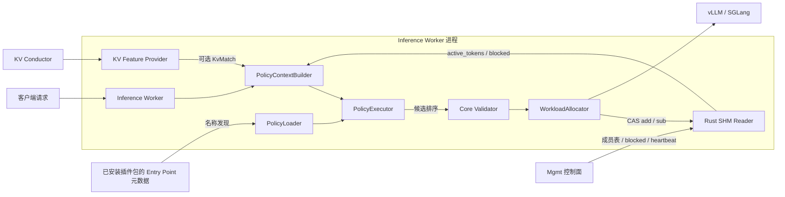
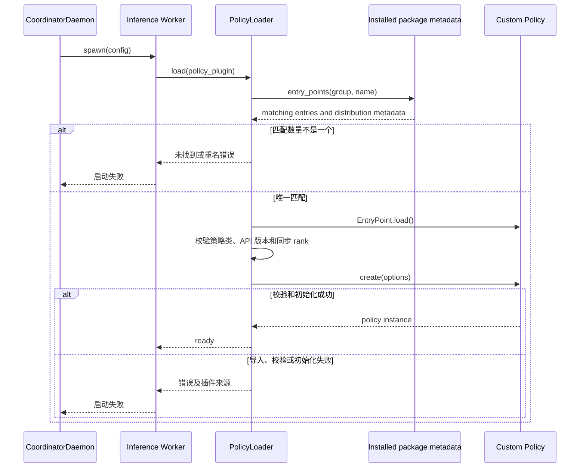
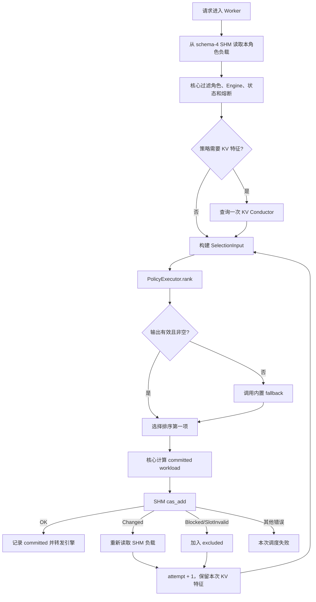
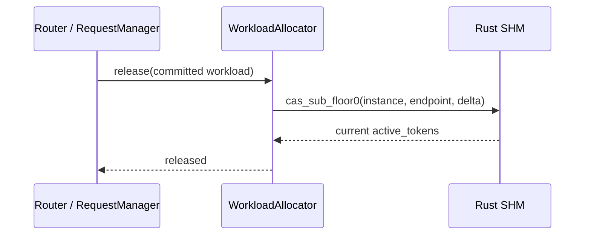
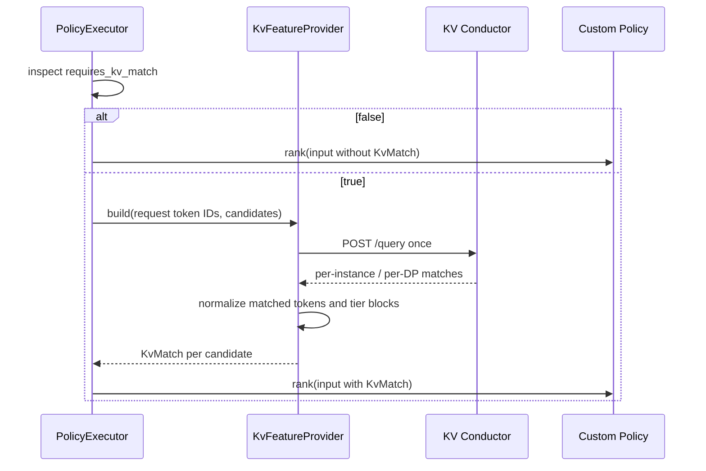

# Coordinator 自定义调度策略插件设计

> 状态：已实现（Inference Worker Entry Point 插件路径）
>
> 前提：[PR #822](https://gitcode.com/Ascend/MindIE-Motor/pull/822) 已合入，Coordinator 已删除独立 Scheduler
> 进程，请求热路径由 Inference Worker 本地打分并通过 Rust schema-4 SHM CAS 完成负载分配与释放。

## 1. 背景

Motor 内置 `load_balance`、`round_robin` 和 `kv_cache_affinity` 策略。新增策略目前需要修改 Motor
源码、配置枚举和 Worker 选路分支，无法作为独立 Python 包交付。

本方案面向外部开发者，通过 Python Entry Point 发布和发现独立策略包。部署者安装插件后，在 Motor 配置中填写
策略名称；模块和类的内部路径由插件包维护。开发者只需实现一个同步 `rank()` 方法，即可使用 Motor 提供的：

- 实例与 Endpoint 候选集；
- Rust SHM 中的实时负载；
- 可选的 KV Conductor 命中特征；
- 熔断过滤、CAS 分配、冲突重选、负载释放和异常降级。

## 2. 目标与非目标

### 2.1 目标

1. 自定义策略不修改、不重新构建 Motor。
2. 策略通过独立 wheel 交付，并使用标准 Entry Point 元数据注册。
3. 内置策略和自定义策略使用同一执行路径。
4. 插件可读取实时负载和可选 KV 命中特征。
5. Motor 保持对 SHM、CAS、熔断和 workload 账本的控制。
6. 插件失败时可观测、可降级，不影响账本一致性。

### 2.2 非目标

- 第一版不支持 Rust、C ABI、PyO3 或远程 HTTP 策略。
- 不支持运行时热切换；策略变更通过重启 Inference Worker 生效。
- 不允许插件直接读写 SHM、修改 `Instance` / `Endpoint` 或提交 workload。
- 不允许 `rank()` 执行网络、磁盘或其他阻塞 I/O。
- 不开放自定义熔断、重试、路由拓扑和负载记账公式。

## 3. 设计原则

- **接口最小化**：插件只接收不可变快照并返回候选排序。
- **核心守住一致性**：候选校验、workload 计算、CAS 和回滚由 Motor 完成。
- **按需取特征**：只有声明需要 KV 特征的策略才查询 KV Conductor。
- **失败可降级**：运行时异常或非法输出回退到一个内置策略。
- **进程内独立实例**：每个 `spawn` 出来的 Inference Worker 自行加载插件。
- **按名称启用**：只加载配置指定的 Entry Point，安装插件不会自动启用策略。
- **兼容现有配置**：未配置插件时，`scheduler_type` 行为保持不变。

## 4. 总体架构



### 4.1 职责划分

| 组件 | 职责 |
|------|------|
| `PolicyLoader` | 从固定 Entry Point group 中按名称查找、校验并初始化策略 |
| `PolicyContextBuilder` | 从请求、实例缓存和 SHM 构建不可变输入 |
| `KvFeatureProvider` | 按需查询并归一化 KV Conductor 结果 |
| `PolicyExecutor` | 调用策略、校验输出、记录指标并执行 fallback |
| `WorkloadAllocator` | 计算 workload，执行 CAS、冲突重选和释放 |
| 自定义策略 | 对候选进行纯计算排序 |

Mgmt 不加载、不执行策略，只维护控制面和 SHM 成员信息。

## 5. 公共接口

公共接口放在 `motor.coordinator.scheduler.policy.api`。所有数据对象只读，避免插件修改 Motor 内部状态。

### 5.1 标识与请求上下文

```python
from dataclasses import dataclass

from motor.common.resources.instance import PDRole


@dataclass(frozen=True, slots=True)
class CandidateId:
    instance_id: int
    endpoint_id: int


@dataclass(frozen=True, slots=True)
class RequestContext:
    request_id: str
    role: PDRole
    model_name: str
    prompt_tokens: int
    max_output_tokens: int | None
    required_engine_type: str | None = None
```

不向插件传递原始请求、鉴权信息、完整 Header 或 SHM 句柄。

### 5.2 KV 命中特征

```python
@dataclass(frozen=True, slots=True)
class KvMatch:
    matched_tokens: int
    prefill_cost: float
    hit_ratio: float
    npu_blocks: int | None = None
    cpu_blocks: int | None = None
    disk_blocks: int | None = None
```

`kv_match=None` 表示未请求 KV 特征或本次查询不可用。`SelectionInput.kv_available` 用于区分可用状态。

### 5.3 候选快照

```python
from collections.abc import Mapping


@dataclass(frozen=True, slots=True)
class CandidateSnapshot:
    id: CandidateId
    active_tokens: float
    instance_active_tokens: float
    blocked: bool
    kv_match: KvMatch | None = None
    attributes: Mapping[str, str] | None = None
```

- `active_tokens`：由 Rust schema-4 SHM 原子读取的 Endpoint 实时负载。
- `instance_active_tokens`：同一 Instance 所有有效 Endpoint 的负载总和。
- `blocked`：由核心提供的熔断结果；blocked 候选正常情况下已在调用策略前过滤。
- `attributes`：只读扩展属性，第一版仅提供稳定、文档化的字符串字段。

SHM `slot`、`generation` 和 CAS expected value 是核心实现细节，不暴露给插件。

### 5.4 策略输入输出

```python
from collections.abc import Mapping, Sequence
from typing import Any


@dataclass(frozen=True, slots=True)
class SelectionInput:
    request: RequestContext
    candidates: tuple[CandidateSnapshot, ...]
    excluded: frozenset[CandidateId]
    attempt: int
    kv_available: bool


@dataclass(frozen=True, slots=True)
class RankedCandidate:
    id: CandidateId
    score: float


class LoadBalancingPolicy:
    """Base class for synchronous, in-process scheduling policies."""

    api_version = 1
    requires_kv_match = False

    def __init__(self, options: Mapping[str, Any] | None = None) -> None:
        self.options = options or {}

    def rank(self, selection: SelectionInput) -> Sequence[RankedCandidate]:
        """Return candidates in best-first order; lower score is better."""
        raise NotImplementedError
```

`rank()` 是插件唯一必须实现的方法；需要校验参数时可覆盖构造函数。插件显式声明 `api_version = 1`，由 Loader
对照 Motor 支持的 API 版本进行检查，部署配置不重复填写 API 版本。

### 5.5 输出约束

Motor 在提交前执行以下校验：

1. 返回值必须是有限长度的 `Sequence[RankedCandidate]`。
2. `CandidateId` 必须来自本次输入且不在 `excluded` 中。
3. ID 不得重复，`score` 必须是有限浮点数。
4. 空结果、异常或非法输出触发 fallback。
5. 插件排序只是建议；最终可用性和 CAS 结果以 Motor 核心为准。

## 6. 插件配置与加载

### 6.1 配置

未配置 `policy_plugin` 时继续使用 `scheduler_type`：

```json
{
  "scheduler_config": {
    "scheduler_type": "load_balance"
  }
}
```

启用插件：

```json
{
  "scheduler_config": {
    "policy_plugin": {
      "name": "acme.weighted_tokens",
      "options": {
        "load_weight": 1.0,
        "kv_weight": 0.8
      },
      "fallback": "load_balance"
    }
  }
}
```

| 字段 | 必填 | 语义 |
|------|------|------|
| `name` | 是 | Entry Point 名称，如 `acme.weighted_tokens` |
| `options` | 否 | 传给策略构造函数的 JSON 对象，默认 `{}` |
| `fallback` | 否 | 内置降级策略，默认 `load_balance` |

`fallback` 只允许 `load_balance` 或 `round_robin`，保证降级本身无需 KV 查询，也不会递归加载插件。
配置或插件包变更后重启 Inference Worker 生效；运行中安装包不会触发重新发现。

### 6.2 Entry Point 注册约定

固定 group 为 `mindie_motor.scheduling_policies`。每个 Entry Point 指向一个 `LoadBalancingPolicy` 子类，
由 Motor 调用 `policy_class(options=...)` 创建实例。同一个 wheel 可注册多个策略。
此机制遵循 [PyPA Entry Points 规范](https://packaging.python.org/en/latest/specifications/entry-points/)。

| 标识 | 示例 | 谁使用 |
|------|------|--------|
| 发行包名称 | `acme-motor-policies` | pip 安装和版本锁定 |
| Entry Point group | `mindie_motor.scheduling_policies` | Motor 发现策略 |
| Entry Point 名称 | `acme.weighted_tokens` | Motor 的 `policy_plugin.name` |
| 对象引用 | `acme_motor_policies.weighted:WeightedPolicy` | 插件包声明，Loader 通过 `.load()` 解析 |

名称采用小写 `<提供方>.<策略名>`，允许字母、数字、下划线、点和连字符，并按名称精确匹配。
内置名称 `load_balance`、`round_robin`、`kv_cache_affinity` 保留，外部插件不能覆盖。

仅向 `PYTHONPATH` 放入 `.py` 文件不足以完成注册；开发环境使用 editable install，生产环境安装包含 Entry Point
元数据的 wheel。部署配置只接受 `name`，原设计中的 `class_path` 不进入第一版配置。

### 6.3 发现与加载流程



Loader 使用 Python 3.10+ 标准库的
[`importlib.metadata.entry_points()`](https://docs.python.org/3.10/library/importlib.metadata.html#entry-points)。
发现阶段只读取安装元数据；匹配唯一名称后才执行该 Entry Point 的 `.load()`，不导入其他策略。

加载规则：

1. 校验 `name/options/fallback`，拒绝内置保留名称。
2. 查询固定 group 中与 `name` 完全一致的所有条目。
3. 零匹配时报未安装；多个匹配时报重名，列出每个来源包、版本及对象引用，不按安装顺序择一。
4. 对唯一条目调用 `.load()`，要求结果为 `LoadBalancingPolicy` 子类。
5. 校验 `api_version`、实际覆盖的同步 `rank()` 和布尔类型 `requires_kv_match`，再调用构造函数校验 `options`。
6. 缓存实例供该 Worker 使用；每次请求及 CAS 重试均复用实例，不重复发现和导入。

加载失败使当前 Worker 启动失败，错误包含配置名称、来源包、版本、对象引用和原始原因。运行期间单次调用失败才执行
fallback。未选中的插件不导入，其加载错误不阻断服务。

### 6.4 版本与分发

- Entry Point 名称作为稳定配置标识；插件内部移动模块或重命名类时只需更新包中的对象引用。
- API 兼容由插件的 `api_version` 与宿主支持版本决定；插件发行版本来自 distribution metadata，两者独立。
- API v1 保持现有字段和语义；兼容扩展只增加带默认值的可选字段，破坏性变更提升 API 版本并给出迁移说明。
- 插件发行说明列出验证过的 Motor/Python 版本。生产镜像锁定插件及其依赖版本，所有 Worker 使用同一安装环境。
- Motor 主包可继续使用现有构建工具；外部插件包使用自己的 `pyproject.toml`，无需修改 Motor 的 `setup.py`。

## 7. 选路与 CAS 流程



关键约束：

- CAS `Changed` 后必须使用最新负载重新调用同一个策略，不能盲目提交或直接使用旧排序的第二名。
- 同一次调度仅查询一次 KV Conductor；CAS 重试复用 KV 命中特征，只刷新 SHM 负载。
- workload delta 由 Motor 统一计算，插件输出中不包含 delta。
- pinned instance、路由拓扑选择和 PD 协调模式继续由 Motor 核心处理。

### 7.1 释放流程



插件不参与释放流程。

### 7.2 核心内部接口

内部组件只围绕公共 DTO 工作，不把 `InstanceProvider` 或 SHM 句柄传给插件：

```python
class PolicyLoader:
    def load(self, spec: PolicyPluginConfig) -> LoadBalancingPolicy: ...


class PolicyExecutor:
    def rank(self, selection: SelectionInput) -> tuple[RankedCandidate, ...]: ...


class PolicyContextBuilder:
    async def build(self, request: RequestInfo, role: PDRole) -> SelectionInput: ...


class WorkloadAllocator:
    async def select_and_allocate(
        self,
        request: RequestInfo,
        role: PDRole,
    ) -> tuple[Instance, Endpoint, Workload] | None: ...
```

`PolicyExecutor` 负责输出校验和 fallback；`WorkloadAllocator` 负责 CAS 循环，两者不进入 Mgmt 控制面。

## 8. KV 特征流程



`KvFeatureProvider` 复用现有 Conductor 客户端的超时、熔断和编码逻辑。向插件提供：

- `matched_tokens`；
- `npu_blocks` / `cpu_blocks` / `disk_blocks`（响应包含时）；
- `hit_ratio = matched_tokens / prompt_tokens`；
- `prefill_cost = max(0, prompt_tokens - overlap_credit * matched_tokens)`。

Conductor 查询失败时 `kv_available=False`、`kv_match=None`。策略可返回空结果触发 fallback，也可以按纯负载继续排序。

## 9. 外部开发者接入示例

以下为目标 API v1 的插件项目示例，在实现本方案的 Motor 环境中使用。

### 9.1 编写策略

项目目录：

```text
acme-motor-policies/
├── pyproject.toml
└── src/
    └── acme_motor_policies/
        ├── __init__.py
        └── weighted.py
```

`src/acme_motor_policies/weighted.py`：

```python
from motor.coordinator.scheduler.policy.api import (
    LoadBalancingPolicy,
    RankedCandidate,
    SelectionInput,
)


class WeightedPolicy(LoadBalancingPolicy):
    api_version = 1
    requires_kv_match = True

    def rank(self, selection: SelectionInput) -> list[RankedCandidate]:
        load_weight = float(self.options.get("load_weight", 1.0))
        kv_weight = float(self.options.get("kv_weight", 0.8))
        ranked = []

        for candidate in selection.candidates:
            if candidate.id in selection.excluded:
                continue
            matched = candidate.kv_match.matched_tokens if candidate.kv_match else 0
            score = load_weight * candidate.active_tokens - kv_weight * matched
            ranked.append(RankedCandidate(id=candidate.id, score=score))

        return sorted(ranked, key=lambda item: item.score)
```

### 9.2 声明 Entry Point

`pyproject.toml`：

```toml
[build-system]
requires = ["setuptools>=61"]
build-backend = "setuptools.build_meta"

[project]
name = "acme-motor-policies"
version = "0.1.0"
description = "Acme scheduling policies for MindIE Motor API v1"
requires-python = ">=3.10"

[project.entry-points."mindie_motor.scheduling_policies"]
"acme.weighted_tokens" = "acme_motor_policies.weighted:WeightedPolicy"

[tool.setuptools.packages.find]
where = ["src"]
```

入口名称中的点需要 TOML 引号，避免被解析为嵌套键。该表声明的是插件入口，由 Motor 加载；它不生成命令行程序。
打包格式参见 [PyPA pyproject.toml 指南](https://packaging.python.org/en/latest/guides/writing-pyproject-toml/)。

Motor 由宿主环境提供，示例没有额外依赖；插件需要其他库时在 `[project].dependencies` 声明并随发行锁定。
实际 Python 版本须同时满足宿主和插件要求。

### 9.3 安装与启用

在插件项目根目录进行开发安装：

```bash
python -m pip install -e .
```

生产构建与安装示例：

```bash
python -m pip wheel --no-deps . --wheel-dir dist
python -m pip install ./dist/acme_motor_policies-0.1.0-py3-none-any.whl
```

安装必须使用运行 Inference Worker 的同一个 Python 环境。安装后可只检查元数据，确认注册名称和来源：

```python
from importlib.metadata import entry_points

for entry in entry_points(group="mindie_motor.scheduling_policies"):
    print(entry.name, entry.dist.metadata["Name"], entry.dist.version, entry.value)
```

最后将第 6.1 节中的 `policy_plugin.name` 设置为 `acme.weighted_tokens` 并重启 Coordinator。各 Inference Worker
加载同一策略包，无需修改 Motor 源码、注册枚举或重新构建 Motor wheel。

发布者交付 wheel、参数说明、兼容版本范围和最小测试用例；部署者从选定的软件包仓库安装指定版本。
Motor 运行时不下载或安装插件。

## 10. 异常与降级

| 场景 | 行为 |
|------|------|
| 配置的 Entry Point 未找到 | Worker 启动失败，提示名称、group 和当前 Python 环境 |
| 配置名称匹配多个 Entry Point | Worker 启动失败，列出来源包、版本及对象引用 |
| 对象类型/API 版本不兼容、模块导入或构造失败 | Worker 启动失败，输出插件来源和原因 |
| `rank()` 抛出异常 | 记录异常并调用内置 fallback |
| 返回空结果或非法结果 | 记录原因并调用 fallback |
| KV Conductor 不可用 | 传递 `kv_available=False`，由策略决定继续或 fallback |
| fallback 也无候选 | 返回调度失败，由现有 Router 错误路径处理 |
| CAS Changed | 刷新 SHM 并重新调用策略 |
| CAS Blocked/SlotInvalid | 排除该候选并重新调用策略 |

第一版不对同步 `rank()` 做线程抢占。Motor 记录执行耗时，超过告警阈值时输出日志和指标；阻塞策略属于插件缺陷。

## 11. 可观测性

建议新增以下指标，标签仅使用低基数字段 `policy`：

| 指标 | 含义 |
|------|------|
| `motor_policy_selection_seconds` | 策略执行耗时 |
| `motor_policy_errors_total` | 策略异常或非法输出次数 |
| `motor_policy_fallback_total` | fallback 次数 |
| `motor_policy_cas_retries_total` | CAS 冲突重选次数 |

启动日志记录 Entry Point 名称、发行包名、包版本、对象引用和 API 版本；运行时指标的 `policy` 标签使用 Entry Point
名称，内置 fallback 使用内置策略名称。

成功日志记录策略名、最终 Instance/Endpoint、score、CAS attempt 和是否 fallback；不记录完整请求、token IDs 或
Conductor 原始响应。

## 12. 安全与约束

- 插件是受信任的进程内代码，拥有与 Worker 相同的系统权限。
- Entry Point 用于发现已安装包，不提供沙箱；只有配置指定的策略会被导入和执行。
- `rank()` 不得执行网络、文件、sleep、线程等待或修改全局 Motor 状态。
- Motor 只传递不可变 DTO，不传递内部缓存、Client、SHM 句柄和凭据。
- 配置 `options` 必须是 JSON 可表示的数据。
- 插件包版本和 Motor API 版本由部署系统共同锁定。

## 13. 代码组织

```text
motor/coordinator/scheduler/policy/
├── api.py                  # 公共 DTO 与 LoadBalancingPolicy
├── loader.py               # Entry Point 发现、重名/API 校验与初始化
├── executor.py             # 调用、输出校验、fallback、指标
├── feature_provider.py     # SHM/KV 特征构建
├── factory.py              # 内置策略适配
├── load_balance.py
├── round_robin.py
└── kv_cache_affinity.py
```

`AsyncSchedulerClient.select_and_allocate()` 只依赖 `PolicyExecutor` 和 `WorkloadAllocator`，不再直接判断
`load_balance` / `kv_cache_affinity` / `round_robin`。

## 14. 兼容与演进

### 14.1 兼容策略

- 保留现有 `scheduler_type`，由内置适配器创建同一 `LoadBalancingPolicy` 接口。
- `policy_plugin` 存在时按 Entry Point 名称选择插件，其 `fallback` 显式决定降级策略；`scheduler_type` 不参与此分支。
- 内置策略保留内部工厂注册；外部插件使用固定 Entry Point group，两者最终进入同一 `PolicyExecutor`。
- 原 `class_path` 草案由 `name` 替代；模块路径保存在插件包元数据中。
- 内置算法公式、并列候选顺序和 committed workload 计算保持不变。
- 不新增每请求 ZMQ/HTTP 调度调用。

### 14.2 实施阶段

1. **统一接口**：内置策略适配 `rank()`，移除 Worker 内硬编码分支。
2. **插件加载**：增加按名称配置、Entry Point Loader、来源诊断、版本校验、输出校验与 fallback。
3. **KV 特征**：抽取 `KvFeatureProvider`，查询一次并在 CAS 重试中复用。
4. **交付完善**：独立示例 wheel、editable install 指南、兼容说明、指标和多进程测试。

Rust 插件可作为后续独立方案实现，但应复用相同 DTO 和排序语义，不改变 Python 插件接口。

## 15. 测试设计

### 15.1 单元测试

- Loader：唯一命中、未安装、同名不同包、保留名称、API 版本不兼容、类型错误、未覆盖或异步 `rank()`、构造失败。
- 发现与启用隔离：未配置插件时不发现/导入外部策略；配置一个策略时其他入口的 `.load()` 不被调用。
- Executor：正常排序、异常、空结果、重复 ID、未知 ID、非有限 score、fallback。
- Feature Provider：SHM 负载映射、Instance 聚合负载、KV hit/miss/unavailable。
- 内置策略：迁移前后同输入产生同一 winner。

### 15.2 集成测试

- CAS OK：选择、提交和释放守恒。
- CAS Changed：刷新负载并再次调用插件。
- Blocked/SlotInvalid：候选进入 `excluded` 后重选。
- KV 策略：一次请求只查询一次 Conductor，CAS 重试不重复查询。
- 包安装：在隔离环境安装示例 wheel，以真实 distribution metadata 发现并加载插件，验证插件名称到类的完整链路。
- editable install：开发安装后能发现 Entry Point；裸 `.py` 文件未安装元数据时不能冒充已注册插件。
- `multiprocessing.spawn`：每个 Worker 独立发现和加载同一包版本；同一输入在确定性策略下结果一致。

### 15.3 回归范围

```bash
bash tests/run_tests.sh tests/coordinator/scheduler/
bash tests/run_tests.sh tests/coordinator/
```

## 16. 验收标准

1. 安装外部插件 wheel 后，仅配置 Entry Point 名称即可完成选路，无需修改 Motor。
2. 插件能获得 schema-4 SHM 的实时 `active_tokens`。
3. 声明 `requires_kv_match=True` 后能获得归一化 KV 命中特征。
4. 插件无法绕过核心熔断校验和 SHM CAS。
5. CAS 冲突使用最新负载重新调用同一策略。
6. 插件异常和非法输出可靠降级并有指标。
7. 内置策略行为保持不变，热路径不新增进程间 RPC。
8. 多 Inference Worker 场景下插件可稳定加载、提交和释放负载。
9. 配置名称重名、缺失或 API 不兼容时启动失败并给出可定位的包信息。
10. 策略发现/导入只发生于启动阶段，安装未启用插件不会自动执行其策略代码。
