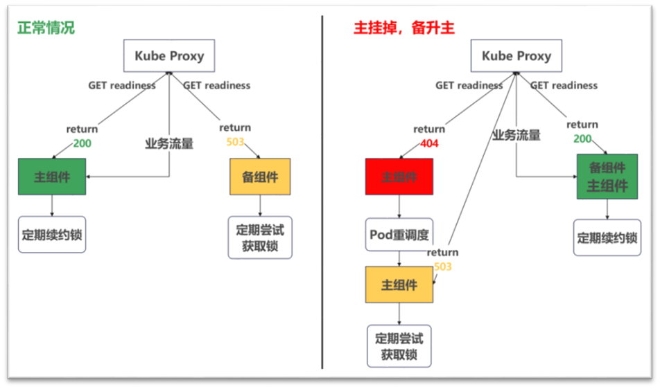
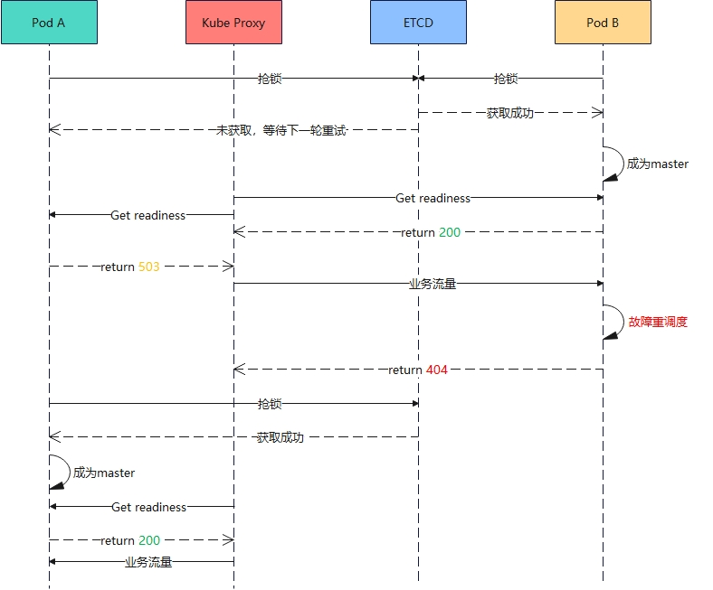

# 主备倒换特性设计文档

## 1. 背景与目的

Controller 和 Coordinator 在默认部署下均为单实例。一旦所在 Pod 或进程故障，整个推理服务不可用。

主备倒换特性通过为每个组件部署两个副本（一主一备），利用 ETCD 分布式锁实现自动角色选举。当主节点故障时，备节点在锁超时后自动抢锁接管，无须人工干预，从而实现推理服务的高可用。

## 2. 整体架构

### 2.1 ETCD 分布式锁选举

Controller 和 Coordinator 的主备选举共享同一套 ETCD 分布式锁机制，由 `StandbyManager`（`motor/common/standby/standby_manager.py`）统一实现。

**StandbyManager 核心设计：**

- 单例模式（`ThreadSafeSingleton`），后台线程运行主循环
- 主循环以 `master_standby_check_interval` 为周期执行：
  - **当前为 Master**：调用 `_renew_master_lock()` 续租 ETCD Lease，续租失败则降级为 Standby 并回调 `on_become_standby()`
  - **当前为 Standby**：调用 `_try_become_master()` 尝试抢锁，成功则升级为 Master 并回调 `on_become_master()`
- 抢锁采用带重试机制：连续失败次数达到 `master_lock_max_failures` 才放弃本轮
- 线程退出时，若持有锁则主动释放（加速切换，不依赖 TTL 超时）

**锁键隔离：**

Controller 和 Coordinator 使用独立的 ETCD 锁键（自动加上 `/controller/` 和 `/coordinator/` 前缀），**两组件的选举完全独立、互不干扰**。

**选举流程：**

<p align="center">
  
</p>

<p align="center"><b>图1. 主备倒换架构图</b></p>

- **正常情况（左图）**：主组件持有 ETCD 锁并定期续租；备组件未持锁，周期性尝试抢锁。业务流量全部路由到主组件。
- **主挂掉，备升主（右图）**：主组件故障后不再续租，ETCD Lease TTL 超时后锁自动释放。备组件在下一轮检查中抢锁成功，升为新主，业务流量切换到新主。

### 2.2 Controller 主备设计

Controller 的主备实现相对简洁：StandbyManager 的 ETCD 锁状态直接决定 Controller 的角色，并通过模块启停和 HTTP 中间件实现流量隔离。

**角色与模块生命周期：**

```text
ETCD 锁 (StandbyManager)
    │
    ├─ on_become_master() → 启动 InstanceManager / EventPusher / FaultManager 等业务模块
    ├─ on_become_standby() → 停掉除 ControllerAPI 外的所有业务模块
    │
    └─ ControllerAPI（始终运行）
           ├─ /readiness  →  直接调用 StandbyManager().is_master()
           ├─ /liveness   →  始终返回 200（进程存活即为健康）
           └─ 中间件      →  standby 时拒绝所有业务请求（返回内部错误）
```

**设计要点：**

- **角色判断无中间层**：`/readiness` 直接查询 `StandbyManager().is_master()`，不经过共享内存等额外抽象
- **Standby 时最小化运行**：ControllerAPI 始终保持运行以响应探针和配置更新请求，但所有业务模块（InstanceManager、EventPusher、FaultManager 等）在 standby 时不启动，节省资源
- **双重流量隔离**：既靠 `/readiness` 返回 503 让 K8s 移出 Service Endpoint，也通过 HTTP 中间件在应用层拦截——即使有请求绕过 Service 到达 standby Pod，中间件也会直接拒绝
- **告警上报**：升主时，从 ETCD 读取 `should_report_event` 键判断是否需要上报 `MasterToSlaveEvent` 事件，随后将该键置为 `true`（确保同一次故障只上报一次）

### 2.3 Coordinator 主备设计

Coordinator 的进程模型较复杂，包含 Daemon、Mgmt、Infer 三类进程。主备设计需要处理跨进程的角色传递和健康检测。

**多进程架构与角色传递：**

```text
Daemon 进程 (coordinator_daemon.py)
    │
    ├─ StandbyManager: 持有 ETCD 锁，角色变更时通过回调通知 Daemon
    │
    └─ RoleShmHolder (role_shm_holder.py): 管理角色共享内存
           byte0  : 角色标识（master/standby）← 角色变更时由 Daemon 写入
           byte1-8: 心跳时间戳                 ← 心跳线程定期写入

Mgmt 进程 (management_server.py)
    │
    ├─ ReadinessProbe  (probe.py): 读共享内存 → 综合判断 → 200/503
    └─ LivenessProbe   (probe.py): 读共享内存 → Daemon 存活判断 → 200/503

Infer 进程: 仅 master 时运行，处理推理请求
```

**角色传递路径：**

ETCD 锁状态（StandbyManager 线程）→ 回调通知 → Daemon 写共享内存 byte0 → Mgmt 进程 ReadinessProbe 读共享内存 → `/readiness` 响应。**锁持有者（Daemon 内的 StandbyManager 线程）和探针响应者（Mgmt 进程）不在同一个进程中**，共享内存是它们之间的桥梁。

**`/readiness` 多维判断：**

Coordinator 的 `/readiness` 不只是"我是 master 吗"，它综合判断以下条件：

| 检查项 | 检测方式 | 不满足时 |
|---|---|---|
| Daemon 是否存活 | 共享内存中检查父进程是否为 Daemon（孤儿检测） | 503 `DAEMON_EXITED` |
| Daemon 心跳是否新鲜 | 共享内存 byte1-8 的时间戳是否在阈值内 | 503 `HEARTBEAT_STALE` |
| 角色是否为 master | 共享内存 byte0 的角色标识 | 503 `NOT_MASTER` |
| 所需实例是否就绪 | `InstanceManager.get_required_instances_status()` | ready 字段为 `false` |

**`/liveness` Daemon 存活检测：**

- 检测 Daemon 孤儿：若 Mgmt 进程的父进程不是 Daemon，说明 Daemon 已退出 → 返回 503 → **触发 Pod 重启**
- 检测 Daemon 心跳过期：与 readiness 共享同一份心跳数据
- 注意：`/liveness` 不关心 master/standby 角色——standby 的 Coordinator 只要 Daemon 活着，liveness 就返回 200，**不会**触发不必要的 Pod 重启

## 3. 主备倒换时序

<p align="center">
  
</p>

<p align="center"><b>图2. 主备倒换时序图</b></p>

时序说明：

1. **初始选主**：Pod A 和 Pod B 同时向 ETCD 抢锁，Pod B 获锁成功成为 Master，Pod A 保持 Standby。
2. **就绪探测**：K8s Readiness Probe 周期性探测两个 Pod 的 `/readiness`。Pod B（Master）返回 200，Pod A（Standby）返回 503。Kube Proxy 仅将业务流量路由到 Pod B。
3. **Master 故障**：Pod B 发生故障，HTTP 服务不可达，K8s Readiness Probe 探测超时/连接拒绝，将 Pod B 移出 Service Endpoint。
4. **备升主**：ETCD Lease TTL 超时后锁自动释放。Pod A 在下一轮抢锁中成功获取锁，升为新 Master，`/readiness` 返回 200。
5. **流量切换**：K8s Readiness Probe 探测到 Pod A 就绪后，将其加入 Service Endpoint，Kube Proxy 将业务流量切换到 Pod A，服务恢复。
6. **原 Master 恢复**：Pod B 重调度后重新启动，以 Standby 角色运行，尝试抢锁失败（新 Master 已持锁），作为新的备节点等待下次切换。

## 4. 关键设计决策

**为什么用 ETCD 分布式锁而非 K8s Leader Election？**

项目本身已依赖 ETCD 作为服务发现和配置存储的基础设施，主备选举复用同一套 ETCD 集群，避免引入额外依赖。此外，ETCD Lease 的 TTL 和抢锁间隔均可独立配置，切换时间可预期，便于在故障恢复速度和 ETCD 压力之间灵活权衡。相比之下，K8s 原生 Leader Election 基于 ConfigMap/Lease 资源的注解更新实现，参数粒度较粗，灵活性不如直接操作 ETCD。

**为什么备节点的 `/readiness` 返回 503 而非 404？**

503 Service Unavailable 的语义精确表示"服务暂时不可用"——节点在运行，但当前不具备承接流量的条件。404 Not Found 则暗示端点不存在，容易误导运维排查（误以为路由配置错误或端点未注册）。二者在 K8s 层面的效果相同（均将 Pod 移出 Endpoint），但 503 的语义更准确地表达了 standby 的状态。

**为什么 Coordinator 需要 Daemon + 共享内存的角色传递，而 Controller 不需要？**

Coordinator 的多进程架构（Daemon / Mgmt / Infer）要求 ETCD 锁持有者（Daemon 内的 StandbyManager 线程）与 HTTP 探针响应者（Mgmt 进程）解耦。共享内存作为进程间的角色传递通道，同时承担 Daemon 心跳功能——Mgmt 进程通过心跳判断 Daemon 是否存活，一旦 Daemon 崩溃可以主动返回 503 触发 Pod 重启。Controller 为单进程模型，StandbyManager 和 HTTP 服务在同一进程内，直接函数调用即可获取角色，无需额外的进程间通信机制。
