# Function Call 亲和性调度 详细设计

> 适用代码范围：`motor/coordinator/scheduler/policy/function_call_affinity.py`、
> `motor/coordinator/scheduler/policy/factory.py`、`motor/config/coordinator.py`、
> `motor/coordinator/scheduler/runtime/scheduler_client.py`。

---

## 1. 背景与动机

LLM Agent / Function-Call 工作负载具有极强的**前缀复用**特征：

1. **`tools` schema 共享**：同一 Agent 在多个请求里通常重复使用相同的 tool 定义，长度可达数千 tokens，是一段稳定的"长前缀"。
2. **多轮 `tool_calls`**：随着对话轮数增长，前缀单调累加，但工具集保持稳定。
3. **conductor 不可用 / tokenizer 缺失**：现有 `kv_cache_affinity` 依赖 conductor 服务返回的 token-id 最长前缀匹配长度，当 conductor 不可达、tokenizer 未加载，或匹配长度为 0 时，会**完全退化为负载均衡**，丢失 KV-cache 复用机会。

针对上述问题，本特性新增 `function_call_affinity` 调度策略，通过**对 tools schema 取稳定指纹做 sticky 路由**，在 conductor 信号缺失或 KV 命中为 0 的边界场景下仍能稳定提高 cache 命中率。

### 1.1 与现有策略的差异

| 维度 | round_robin | load_balance | kv_cache_affinity | **function_call_affinity** |
| --- | --- | --- | --- | --- |
| 选择信号 | 计数器 | 实时负载 | conductor 返回的最长 token-id 匹配 | tools 指纹 + 上述全部 |
| 是否依赖 conductor | 否 | 否 | **是** | 否（缺失时 fallback） |
| 是否依赖 tokenizer | 否 | 否 | **是** | 否（缺失时 fallback） |
| 多轮粘性 | 无 | 无 | 取决于 token-id 重叠 | **强（指纹相同即粘性）** |
| 失败回退 | 无 | round_robin | load_balance → round_robin | kv_cache_affinity → load_balance → round_robin |

---

## 2. 设计目标

| ID | 目标 | 验收 |
| --- | --- | --- |
| G1 | 同 tools schema 的请求尽量被路由到同一 `(instance, endpoint)` | 单元测试 `test_sticky_routing_on_fingerprint_hit` |
| G2 | 实例下线 / endpoint 下线时自动失效粘性记录 | `test_sticky_invalidated_when_instance_gone` / `test_sticky_invalidated_when_endpoint_gone` |
| G3 | conductor / tokenizer 不可用时仍能调度（不破坏可用性） | `test_falls_back_to_load_balance_when_kv_fails` |
| G4 | 内存与延迟可控（缓存大小、TTL 可配置；hot path 单锁） | LRU+TTL 设计 + 并发压测 |
| G5 | 完全向后兼容：未启用时所有现有路径行为不变 | factory 注册式接入；`SchedulerType` 仅新增枚举 |
| G6 | 不依赖 conductor / tokenizer，可在 kv_cache_affinity 不可用环境下独立工作 | sticky-only 路径无外部依赖 |

---

## 3. 总体架构

### 3.1 上下文图（C4-Context 视角）

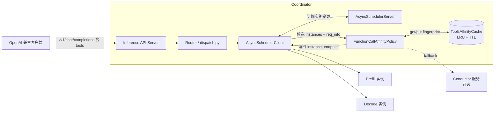

### 3.2 进程内组件层次

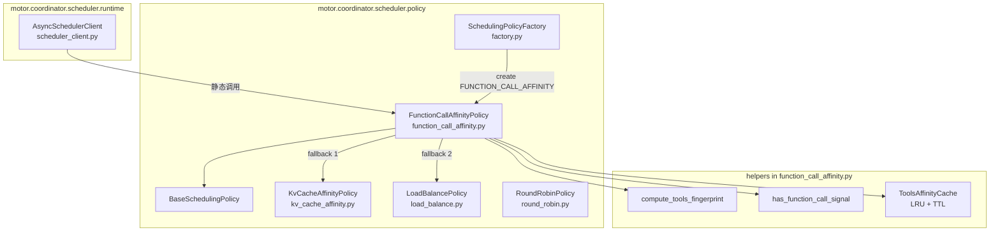

---

## 4. 关键类与数据结构

### 4.1 类图

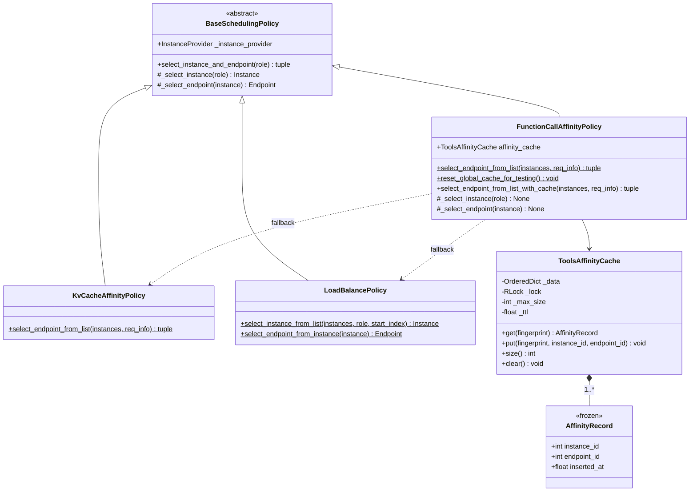

### 4.2 缓存数据结构

`ToolsAffinityCache` 使用 `OrderedDict` 实现 LRU，附加 `inserted_at` 字段做 TTL 判定。读路径单 `RLock`；过期项在 `get` 中 lazy 淘汰（避免后台线程）。

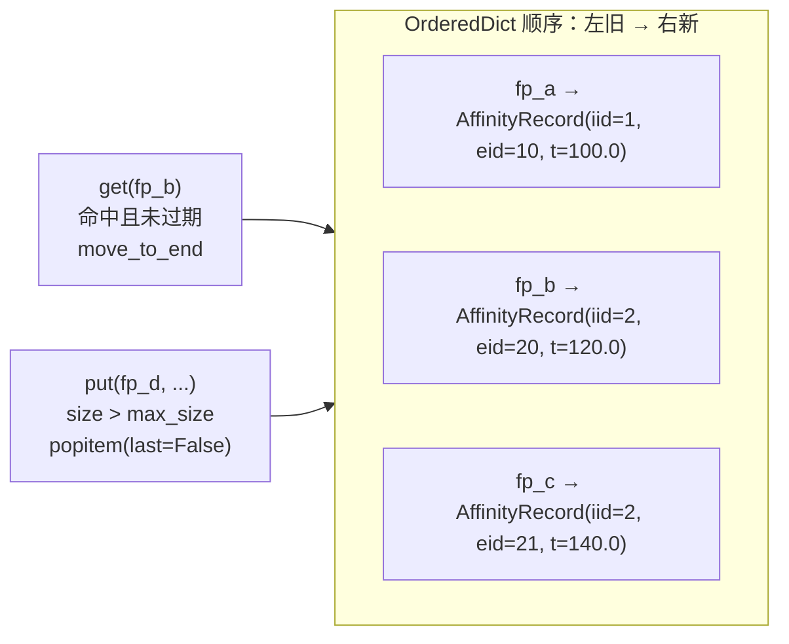

### 4.3 指纹生成

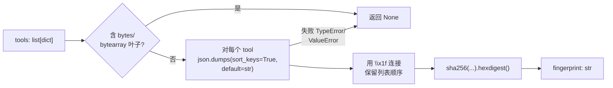

要点：

- **键内排序**：`sort_keys=True` 让相同字段不同顺序产生相同指纹。
- **列表外不排序**：tools 顺序会影响 chat-template 渲染输出与 prefix 局部性，必须保留。
- **bytes 拒绝**：`json.dumps(default=str)` 会把 `bytes` 静默 `str()` 化产生不稳定值，因此先 `_walk_values` 拒绝。
- **稳定性**：仅依赖标准库 `json` + `hashlib.sha256`，跨进程/跨主机一致。

---

## 5. 调度算法（核心流程）

### 5.1 主流程图

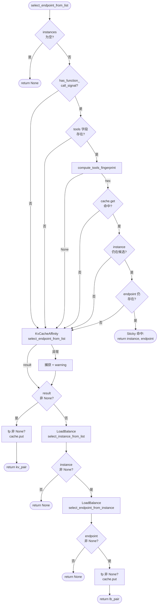

### 5.2 状态图：单条指纹的生命周期

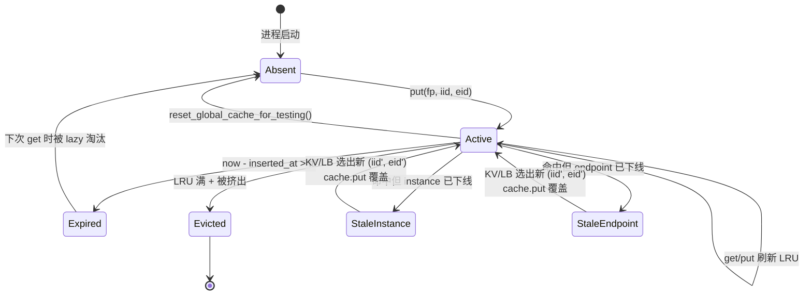

---

## 6. 时序图

### 6.1 同 tools schema 三次连续请求（典型场景）

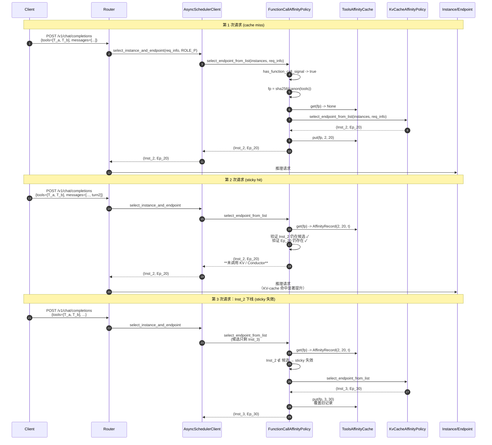

### 6.2 conductor 不可用时的兜底（KV 路径返回 None）

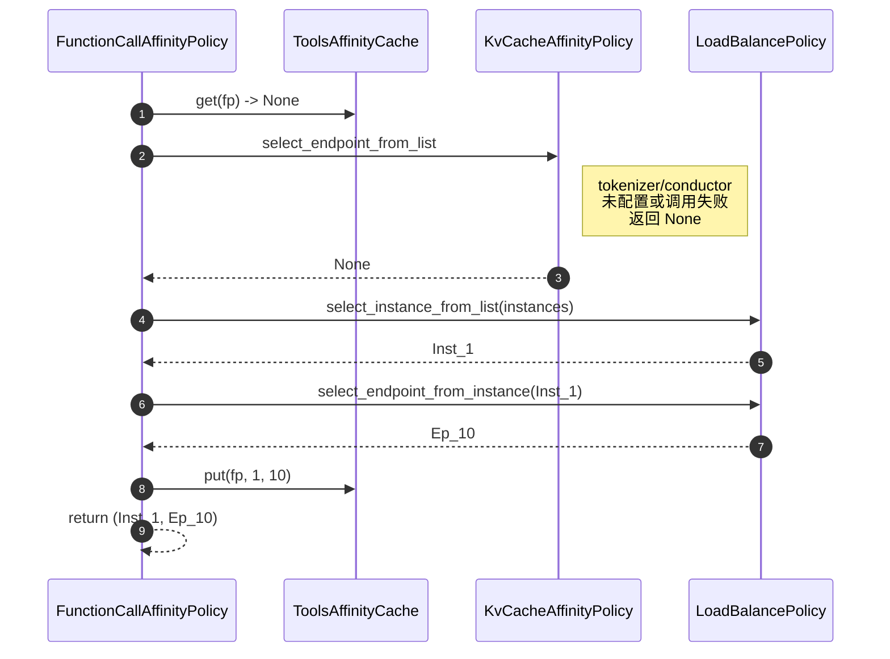

### 6.3 AsyncSchedulerClient runtime 完整路径

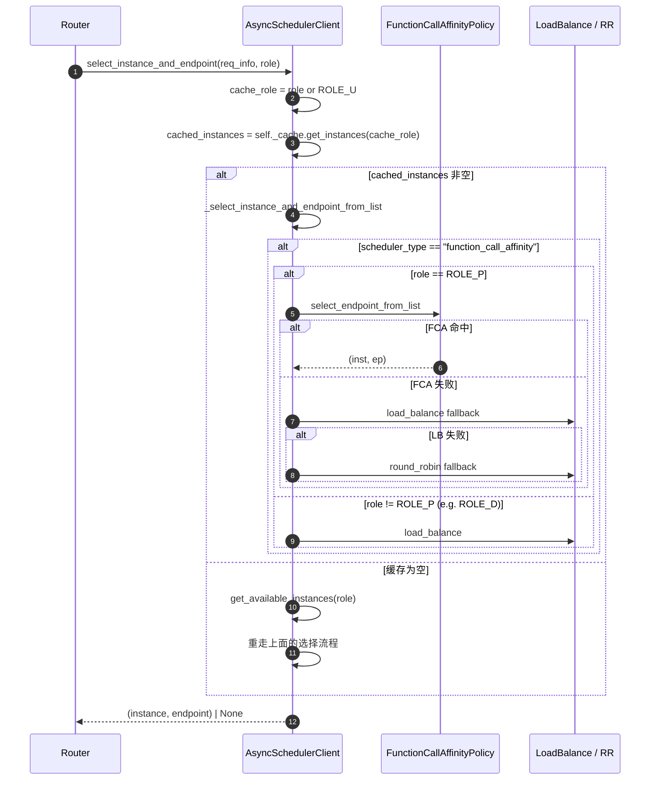

---

## 7. 接口契约

### 7.1 配置侧

`motor/config/coordinator.py`：

```python
class SchedulerType(Enum):
    LOAD_BALANCE = "load_balance"
    ROUND_ROBIN = "round_robin"
    KV_CACHE_AFFINITY = "kv_cache_affinity"
    FUNCTION_CALL_AFFINITY = "function_call_affinity"   # ← 新增
```

启用方式：在 `user_config.json` 的 `scheduler_config` 中将 `scheduler_type` 设为 `"function_call_affinity"`，与已有 `kv_cache_affinity` 启用方式一致。

### 7.2 公共 API

`motor/coordinator/scheduler/policy/function_call_affinity.py` 暴露的入口：

| 名称 | 形式 | 用途 |
| --- | --- | --- |
| `compute_tools_fingerprint(tools)` | 模块函数 | 仅用于本策略，但导出以便测试与未来扩展（如打到 metrics） |
| `extract_tools(req_data)` | 模块函数 | 标准化 tools 提取，防御 `None` / 非 dict 输入 |
| `has_function_call_signal(req_data)` | 模块函数 | 一站式 function-call 信号探测 |
| `ToolsAffinityCache(max_size, ttl_seconds)` | 类 | 可独立用于其他策略的指纹缓存 |
| `FunctionCallAffinityPolicy.select_endpoint_from_list(instances, req_info)` | 静态方法 | runtime 路径直接调用，使用进程级缓存 |
| `FunctionCallAffinityPolicy(...).select_endpoint_from_list_with_cache(...)` | 实例方法 | 单元测试或多策略隔离场景，每个 policy 实例独占缓存 |
| `FunctionCallAffinityPolicy.reset_global_cache_for_testing()` | 静态方法 | 仅供测试 |

> 静态 + 实例两套 API 是有意设计：runtime 路径需要跨请求复用同一缓存（粘性），而单测希望每次干净起步；这两个需求由两套 API 自然承担。

### 7.3 不变量（Invariants）

| ID | 描述 |
| --- | --- |
| INV-1 | 任何路径返回的 `(instance, endpoint)` 中 `endpoint ∈ instance.get_all_endpoints()`。 |
| INV-2 | `cache.size() <= max_size` 任意时刻成立。 |
| INV-3 | 仅当本次成功选出 `(instance, endpoint)` 且 `fingerprint != None` 时才会写入缓存。 |
| INV-4 | 失败链不会引发 `Exception` 冒泡到调用方（KV 异常被 `_safe_kv_select` 捕获并打 warning）。 |

---

## 8. 并发与线程安全

### 8.1 并发读写模型

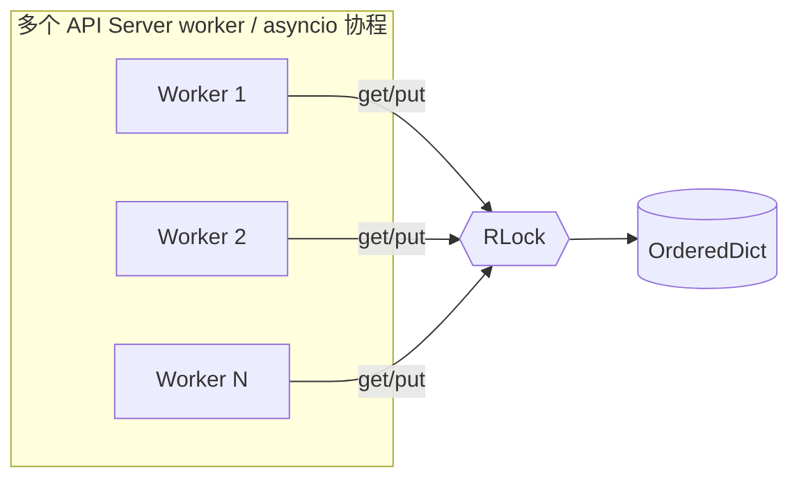

- **锁粒度**：单 `RLock` 包住 `OrderedDict` 操作。临界区只做 dict 索引、`move_to_end`、`popitem`、`pop`，全部为常数时间操作，不阻塞 IO。
- **可重入**：选用 `RLock` 是为兼容未来在锁内回调（虽然当前实现没有）。
- **无死锁风险**：缓存 lock 与外部锁（如 `Instance._lock`）调用顺序为单向（policy → cache），且没有从 cache 回调到 instance 的反向路径。
- **lazy 过期**：避免后台线程，过期项在 `get` 时被丢弃；最坏情形为 N 个并发 worker 同时观察到过期项，各自尝试 `pop`，但 `pop(default=None)` 保证幂等。

### 8.2 并发测试

`test_thread_safety_basic`：8 个线程 × 50 次 `put + get`，断言执行无异常且 `size <= max_size`。

---

## 9. 性能分析

### 9.1 复杂度

| 操作 | 时间 | 空间 |
| --- | --- | --- |
| `compute_tools_fingerprint(tools)` | O(\|tools\| · \|tool_dict\|)（一次 JSON 序列化 + 一次 SHA256） | 与 tools 序列化字节数线性 |
| `cache.get` | O(1)（dict 索引 + 链表移动） | — |
| `cache.put` | O(1) 摊销（最多触发一次 `popitem`） | — |
| `_try_sticky` | O(\|instances\|) 找 instance + O(\|endpoints\|) 找 endpoint | — |

### 9.2 与 KV 路径对比

KV 路径每次都会：

1. 调用 tokenizer 编码（一般是数 ms 到数十 ms 量级）；
2. 跨进程访问 conductor（HTTP 调用）；
3. 在所有 instances/endpoints 上做 `longest_matched` 比较。

Sticky 命中时，本策略**完全跳过**这两步，纯内存路径，单请求开销在百纳秒到微秒级。在 tools 稳定的 Agent 场景下命中率高，能显著降低调度延迟。

### 9.3 内存上限

`max_size · sizeof(AffinityRecord + str-fingerprint)` ≈ `1024 × (~80 + 64) B` ≈ **≈ 144 KB**，可忽略。

---

## 10. 失败与降级矩阵

| 场景 | 表现 | 兜底 |
| --- | --- | --- |
| 请求无 `tools` 也无 `tool_calls` | `has_function_call_signal == False`，无指纹 | 直接走 `KvCacheAffinity → LoadBalance → RoundRobin` |
| 有 `tool_calls` 但无 `tools` | 信号 True 但 fingerprint=None | 同上（不写缓存） |
| `tools` 含 bytes 字段 | `compute_tools_fingerprint` 返回 None | 同上 |
| conductor 调用失败抛异常 | `KvCacheAffinityPolicy.select_endpoint_from_list` 异常 | `_safe_kv_select` 捕获并 warning，进入 LoadBalance 兜底 |
| 缓存命中但 instance 下线 | sticky 失效 | KV → LB |
| 缓存命中但 endpoint 下线 | sticky 失效 | KV → LB |
| TTL 过期 | `get` 返回 None | 走 KV → LB，下次再 put 新记录 |
| 候选 instances 列表为空 | 直接 None | 上层处理 503 |

---

## 11. 兼容性与升级影响

| 维度 | 影响 |
| --- | --- |
| 线下二进制 / proto | 无（纯 Python，无新 proto）。 |
| 配置文件 | `scheduler_type` 仅新增可选值，旧值行为不变。 |
| 运维监控 | 复用现有调度日志；新策略额外打印 `function_call_affinity sticky-hit` debug 日志。 |
| 其他策略 | 零侵入：通过 factory 注册接入，未启用时整条调用链都不会被触达。 |
| 接口/客户端 | 客户端无需改动；启用方式仅修改 coordinator 侧 scheduler 配置。 |

---

## 12. 测试设计（TDD）

### 12.1 测试金字塔

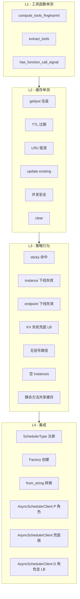

### 12.2 用例对应表

| 测试 | 对应需求 |
| --- | --- |
| `TestComputeToolsFingerprint::*` | 设计 §4.3、INV-3 |
| `TestToolsAffinityCache::*` | 设计 §4.2、INV-2、§8 |
| `TestFunctionCallAffinityPolicy::test_sticky_routing_on_fingerprint_hit` | G1、§5.1 |
| `..._sticky_invalidated_when_instance_gone` / `..._endpoint_gone` | G2、§5.2 |
| `..._falls_back_to_load_balance_when_kv_fails` | G3、§10 |
| `..._no_signal_uses_kv_only` | §10、INV-3 |
| `..._static_helper_uses_global_cache` | §7.2 |
| `TestSchedulerTypeAndFactory::*` | §7.1、G5 |
| `TestSchedulerClientFunctionCallAffinityRouting::*` | §6.3、runtime 集成 |

### 12.3 TDD 节奏

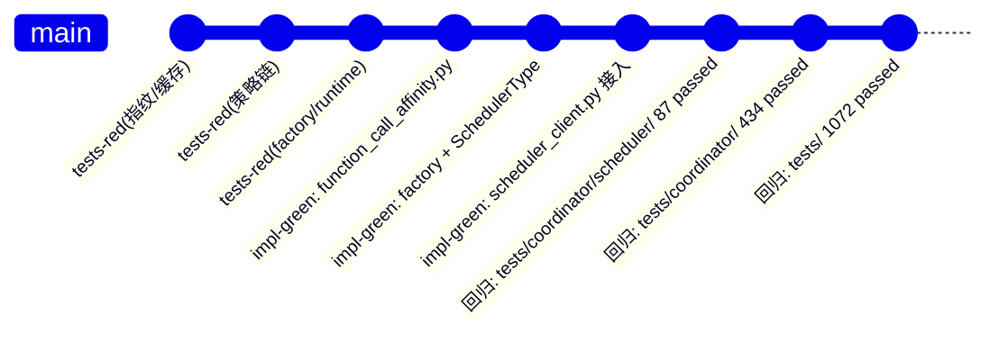

---

## 13. 维测（DFX）能力

| 维度 | 设计 |
| --- | --- |
| 日志 | `INFO`：策略启动；`DEBUG`：sticky 命中输出 `instance_id=...,endpoint_id=...`；`WARNING`：KV 异常、各级 fallback 触发 |
| Metrics（未来） | 预留指标点位：`fc_affinity_sticky_hit_total{instance_id}`、`fc_affinity_kv_fallback_total`、`fc_affinity_lb_fallback_total` |
| 故障定位 | 复用现有 trace 头透传；在 sticky 命中时不发起 conductor 请求，conductor trace 中"消失"是符合预期的可观测信号 |

---

## 14. 风险与未来扩展

### 14.1 已识别风险

| 风险 | 影响 | 缓解 |
| --- | --- | --- |
| 长尾 tools 多样化 → 指纹爆炸 | 缓存 churn 增加，命中率下降 | LRU 上限 + TTL；可调参 |
| 进程重启后缓存丢失 | 首次请求退化为 KV 路径 | 接受：等价于冷启动 |
| 多 Coordinator 实例 | 不同 worker 各自缓存，可能选不同实例 | 可接受（KV 路径仍会兜底）；未来可考虑用 etcd / Conductor 做共享 |
| tools 顺序变化 → 误判为不同请求 | 命中率下降但不影响正确性 | 设计上有意保留顺序敏感性（影响 chat-template 输出） |

### 14.2 未来扩展点

1. **共享指纹缓存**：通过 etcd 或 conductor 的 KV 接口对外暴露 fingerprint→instance 映射，让多 worker / 多 Coordinator 协同。
2. **自适应 TTL**：根据 instance 平均空闲时间动态调整 TTL。
3. **MetaServer 路径接入**：当 Decode 角色也需要 sticky 时，复用同一缓存（当前 D 角色走纯 LB）。
4. **混合权重**：将 fingerprint sticky 与 longest_matched 长度做加权评分，而不是当前的二元决策。

---

## 15. 相关代码文件

| 文件 | 角色 |
| --- | --- |
| `motor/coordinator/scheduler/policy/function_call_affinity.py` | 本特性核心实现 |
| `motor/coordinator/scheduler/policy/factory.py` | 工厂注册 |
| `motor/coordinator/scheduler/policy/__init__.py` | 公共导出 |
| `motor/config/coordinator.py` | `SchedulerType.FUNCTION_CALL_AFFINITY` |
| `motor/coordinator/scheduler/runtime/scheduler_client.py` | runtime 路径接入 |
| `tests/coordinator/scheduler/test_function_call_affinity.py` | 全量单元测试 |
