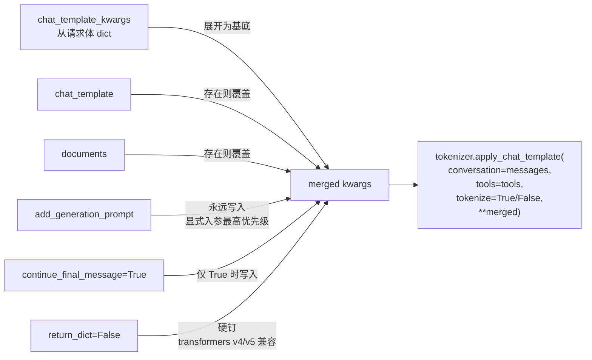
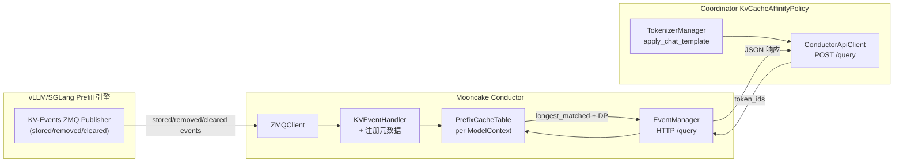
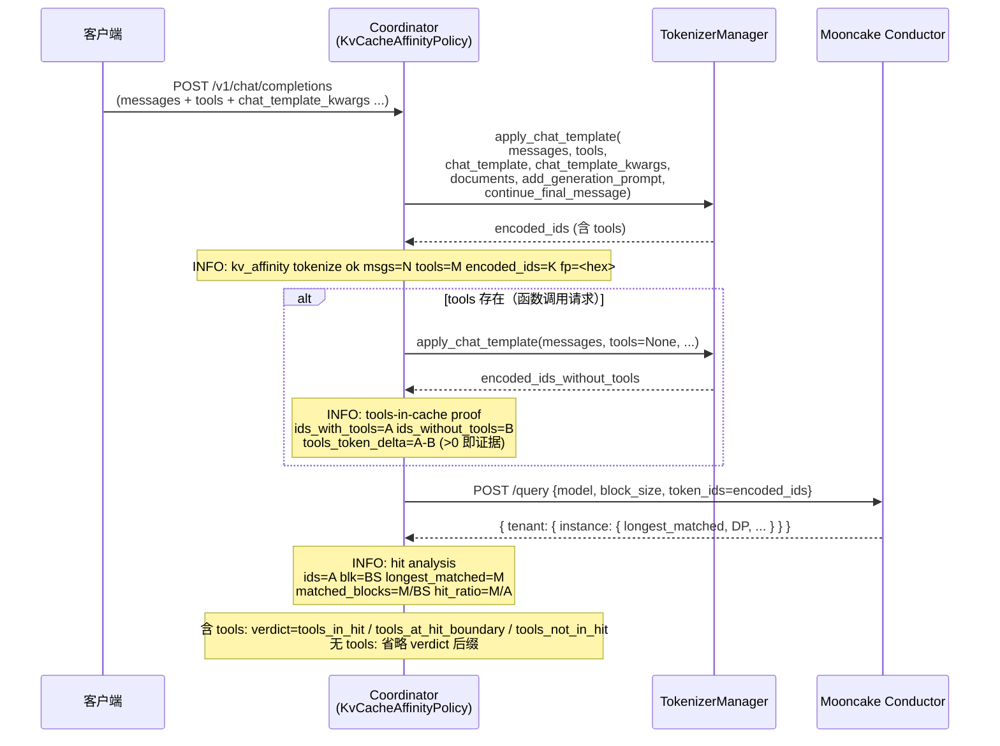
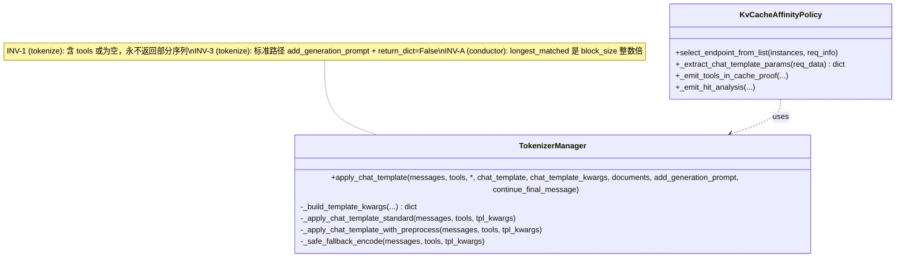
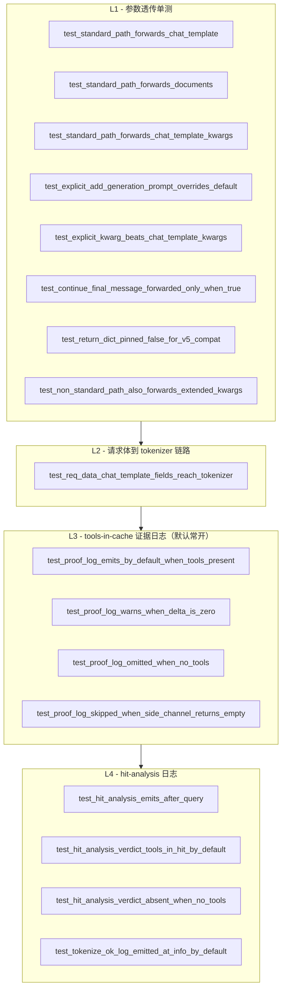

# KV-Cache 亲和性：Prefix-Cache 命中率计算 与 Tools-in-Cache 证据日志 详细设计

> 适用代码范围：`motor/coordinator/scheduler/policy/kv_cache_affinity.py`、
> `motor/coordinator/api_client/conductor_api_client.py`、
> `motor/coordinator/models/constants.py`、
> `tests/coordinator/scheduler/test_kv_cache_affinity.py`。
>
> 前置阅读：[`tools_aware_tokenize_design.md`](./tools_aware_tokenize_design.md)（修复 tokenize 链 漏 tools 的最小修复）。
> 本文聚焦两件事：
> 1. 把 Coordinator 调用 `tokenizer.apply_chat_template` 的入参与 vLLM 全量对齐；
> 2. 解释 Mooncake conductor 算 `longest_matched`（亦即 prefix-cache 命中率）的精确语义，并提供**可证明 tools 已纳入 prefix-cache 计算的运行时日志**。

---

## 1. 背景

[`tools_aware_tokenize_design.md`](./tools_aware_tokenize_design.md) 修复了"tools 没传给 tokenizer"这一**正确性 0/1 缺陷**，让 function-call 请求的 token 序列里至少**包含**了 tools 的渲染产物。Code review 后追加两条工程问题：

> Q1：当前 `kv_cache_affinity.py` 把 `tools` 送入 tokenizer 时，**和 vLLM 送入 tokenizer 的参数是否一致**？vLLM 还额外送入哪些参数需要我们同步传入适配？
>
> Q2：当前 **prefix-cache 命中率是如何计算的**？需要参考 Mooncake conductor 的相关文档把计算逻辑讲清楚。以及——如何**证明**当前请求里的 `tools` 内容真的纳入了 prefix-cache 计算？能否加日志打印来佐证？

本文档同时回答这两点，并配套一条"运行时可证伪"的日志通路。

---

## 2. Q1：与 vLLM `apply_chat_template` 入参对齐

### 2.1 vLLM 推理端的精确调用

vLLM `entrypoints/openai/chat_completion/serving.OpenAIServingChat` 最终在 `vllm/renderers/hf.py::safe_apply_chat_template` 里这样调 HuggingFace tokenizer：

```python
return tokenizer.apply_chat_template(
    conversation=conversation,
    tools=tools,
    chat_template=chat_template,              # 1
    tokenize=tokenize,                        # 默认 True
    **resolved_kwargs,                        # 2: 含 add_generation_prompt / documents
                                              #    / continue_final_message / return_dict=False
                                              #    / 以及请求体 chat_template_kwargs 透传的所有 entry
)
```

`resolved_kwargs` 来自两条链路合并（见 `vllm/renderers/params.py::ChatParams.get_apply_chat_template_kwargs` 与
`vllm/renderers/hf.py::resolve_chat_template_kwargs`）：

| 来源 | 字段 | 说明 |
| --- | --- | --- |
| 请求体 | `chat_template` | 用户在单次请求里覆盖默认模板（或选择多模板下的具名 variant，如 Cohere "tool_use"）。 |
| 请求体 | `chat_template_kwargs` | 自由 dict，原样透传给 jinja。常见键：`enable_thinking`（Qwen3）、`add_generation_prompt`、`continue_final_message`、模型自定义 flag。 |
| 请求体 | `documents` | RAG 显式 docs 数组（HF transformers v4.44+ 的 `apply_chat_template` 一等参数）。 |
| 请求体 | `add_generation_prompt` | 默认 `True`；显式 `False` 用于 assistant 续写。 |
| 请求体 | `continue_final_message` | 续写最后一条 assistant 消息，而不是新建一轮。 |
| 服务侧 | `default_chat_template_kwargs` | `--default-chat-template-kwargs` 启动参数提供的兜底默认值。 |
| 服务侧 | `chat_template` | `--chat-template` 启动参数提供的全局默认模板。 |

### 2.2 修复前 Coordinator 的入参

```python
self.tokenizer.apply_chat_template(
    conversation=messages,
    tools=tools,
    add_generation_prompt=True,
    tokenize=True,
    return_dict=False,
)
```

只覆盖了 `tools` + `add_generation_prompt` 这条最常见的链路，**完全没有从请求体里读取**：

- `chat_template`：用户请求级模板被忽略；
- `chat_template_kwargs`：Qwen3 的 `enable_thinking=False` 等关键 flag 会被丢；
- `documents`：RAG 文档不进 token 序列；
- `add_generation_prompt=False`：用户显式关闭被忽略（继续被强制 `True`）；
- `continue_final_message=True`：assistant 续写场景被忽略。

后果：vLLM/SGLang 推理端实际看到的 token 序列与 Coordinator 算出的序列**不一致**。conductor `longest_matched` 与真实 KV-cache 分布**再次脱钩**——和上次"漏 tools"是同一类问题，只是漏掉的内容不同。

### 2.3 修复后的入参（与 vLLM 字节对齐）

`TokenizerManager.apply_chat_template` 现在显式接受全部 vLLM 对齐 kwargs：

```python
def apply_chat_template(
    self,
    messages: list,
    tools: list | None = None,
    *,
    chat_template: str | None = None,
    chat_template_kwargs: dict | None = None,
    documents: list | None = None,
    add_generation_prompt: bool = True,
    continue_final_message: bool = False,
) -> list[int]: ...
```

合并策略（`_build_template_kwargs`）镜像 vLLM `merge_kwargs`：



> `return_dict=False` 必须硬钉：transformers v5 默认 `True`，会把 `tokenize=True` 的返回从 `list[int]` 变成 `BatchEncoding`，下游再做 `len(...)` 等于错值。`safe_apply_chat_template` 在 vLLM 里走的也是这个补丁。

### 2.4 `select_endpoint_from_list` 的请求体透传

```python
chat_template_params = KvCacheAffinityPolicy._extract_chat_template_params(req_data)
encoded_ids = manager.apply_chat_template(messages, tools, **chat_template_params)
```

`_extract_chat_template_params` 从 `req_data` 抽取上述 5 个 vLLM 对齐字段（默认值见下表）：

| OpenAIField | 默认值 | 说明 |
| --- | --- | --- |
| `chat_template` | `None` | 不显式覆盖时由 tokenizer 用自身默认模板。 |
| `chat_template_kwargs` | `None` → `{}` | 空 dict 等价于无额外 flag。 |
| `documents` | `None` | RAG 场景显式赋值。 |
| `add_generation_prompt` | `True` | 与 vLLM chat completion 默认对齐。 |
| `continue_final_message` | `False` | 显式 `True` 才透传，避免无效 key 落进非续写模板。 |

### 2.5 显式未对齐项 (Won't, with rationale)

1. **服务侧 `--chat-template` 全局默认**：Coordinator 进程拿不到 vLLM engine 启动参数；如果上游不显式在请求体里带 `chat_template`，则 Coordinator 用 tokenizer 自带模板，**与 engine 用 `--chat-template` 覆盖后的模板不一致**。本次先不处理；后续可以让 `motor_engine_prefill_config.engine_config.chat_template` 同步配置到 `prefill_kv_event_config.chat_template`，Coordinator 启动时加载（独立 task）。
2. **服务侧 `--default-chat-template-kwargs`**：同上。
3. **`mm_processor_kwargs` / 多模态相关**：当前 KV-Cache 亲和性调度只覆盖文本 prefill，多模态 chunk 走另一套路径，不在本次修复范围。

> 这两个未对齐项**目前不会触发**新的"漏 tools 类"灾难——只要请求体里把模板/flag 显式带上（OpenAI 客户端的常见做法），就完全对齐 vLLM。但仍记入 NoT 清单，避免后续遗忘。

---

## 3. Q2：Prefix-Cache 命中率是如何计算的

> 直接权威来源：
>
> - [Mooncake Conductor Architecture](https://kvcache-ai.github.io/Mooncake/design/conductor/conductor-architecture-design.html)
> - [Mooncake Conductor Indexer API](https://kvcache-ai.github.io/Mooncake/design/conductor/indexer-api-design.html)
> - 仓库实现：`https://github.com/kvcache-ai/Mooncake/tree/dev/kv-indexer/mooncake-conductor/conductor-ctrl/prefixindex/`

### 3.1 整体数据流



### 3.2 `longest_matched` 的精确语义

`POST /query` 接受 `token_ids`（以及 `model` / `block_size` / `tenant_id` / `cache_salt` / `lora_name` 等限定维度），返回：

```json
{
  "default": {
    "vllm-prefill-node1": {
      "longest_matched": 256,
      "GPU": 128,
      "DP": { "0": 128, "1": 256 },
      "CPU": 256,
      "DISK": 0
    }
  }
}
```

权威定义（[Indexer API 文档](https://kvcache-ai.github.io/Mooncake/design/conductor/indexer-api-design.html)）：

> `longest_matched`: Longest continuous prefix hit in tokens across all tracked media and DP ranks for this instance.

精确语义可以拆成三条不变量：

| ID | 不变量 |
| --- | --- |
| INV-A | **块对齐**。Conductor 把 `token_ids` 按 `block_size` 切成完整块（trailing partial block 丢弃）。`longest_matched = matched_block_count * block_size` 永远是 `block_size` 的整数倍。 |
| INV-B | **滚动哈希 + 前缀连续**。每个完整块算 XXH3-64 局部哈希，再与上一个 `seq_hash` 拼接做滚动哈希。conductor 顺序扫描，**第一次 miss 即终止**（保证"前缀"语义，不允许中间洞穿）。 |
| INV-C | **跨介质合并**。`longest_matched` 是该 instance 在所有 medium（GPU/CPU/DISK）和所有 DP rank 上取并集后的最长前缀，而 `GPU` / `CPU` / `DISK` / `DP.<rank>` 字段是各自维度独立扫描的最长前缀。 |

因此，**Prefix-Cache 命中率 = `longest_matched / len(token_ids)`**（按 token 计），但实际"能复用的块数"= `longest_matched // block_size`。

### 3.3 输入哈希链 = 必须与引擎字节对齐

`POST /query` 的 `token_ids` 是 conductor 算前缀哈希的**唯一输入**——这正是 §2 反复强调的"Coordinator 端 tokenize 必须与 engine 端 chat-template 渲染逐字节一致"的根因。任意一个 token 错位 → 后续所有 `seq_hash` 全错 → conductor 把"实际能命中"的请求误判为"几乎不命中"。

### 3.4 `query_data` 字段对照

Coordinator 端 `ConductorApiClient.query_conductor` 当前发送：

```python
query_data: dict = {
    "model": instances[0].model_name,
    "block_size": prefill_kv_event_config.block_size,
    "token_ids": encoded_ids,
}
if TENANT_ID != "default":
    query_data["tenant_id"] = TENANT_ID
```

与 conductor 接受字段对比：

| conductor 字段 | 当前传 | 说明 |
| --- | --- | --- |
| `model` | ✅ | `instances[0].model_name`。 |
| `block_size` | ✅ | 与 `/register` 一致（必须）。 |
| `token_ids` | ✅ | tokenize 后的完整序列（含 tools，本次修复保障）。 |
| `tenant_id` | 仅非默认 | 默认 `"default"`。 |
| `instance_id` | ❌ 不传 | 不传 = 查所有同 tenant 注册实例，让 Coordinator 自己挑 `longest_matched` 最大者（当前策略）。 |
| `lora_name` | ❌ 不传 | 当前部署未使用 LoRA；如启用需同步加。 |
| `cache_salt` | ❌ 不传 | 当前部署未配置 `additional_salt`；如使用 W8A8 等量化族分组需同步加。 |

> `lora_name` 和 `cache_salt` 不传 = 走默认 namespace。如果未来同一 conductor 跨多 LoRA / 多量化族复用，需要把这两个字段同步进 `prefill_kv_event_config` 并随 `/register` + `/query` 一起带。当前一致即可，不在本次修复范围。

---

## 4. 证明 tools 真的进了 prefix-cache 计算

"tokenize 时把 tools 传进 jinja 了"和"conductor 拿到的 `longest_matched` 真的覆盖了 tools 段"——这是两件事。前者 §2 已经保证；后者**需要运行时可观测的证据链**。

### 4.1 证据链由三条日志构成

| 日志 | 级别 | 角色 |
| --- | --- | --- |
| `kv_affinity tokenize ok` | **INFO**（默认每请求都打）| 每次请求记录 `msgs=N tools=M encoded_ids=K fp=<8hex>`。`fp` 是 `encoded_ids` 的 BLAKE2b-32 指纹，**两次相同请求的 fp 必须相同**，跨请求可比对前缀。 |
| `kv_affinity tools-in-cache proof` | **INFO**（默认开启，仅当 `tools` 存在时打印）| **侧信道**把同一请求**不带 tools** 再 tokenize 一次，记录 `tools_token_delta = ids_with_tools - ids_without_tools`。`tools_token_delta > 0` = "tools 真的进了 token 序列、真的被送进 conductor"。 |
| `kv_affinity hit analysis` | **INFO**（默认每命中都打）| conductor `/query` 成功返回后，记录 `ids / blk / longest_matched / matched_blocks / hit_ratio`。`tools` 存在且侧信道成功时，附带 `verdict=tools_in_hit / tools_at_hit_boundary / tools_not_in_hit`，直接给出"tools 段是否被 conductor 当作命中"的判定；无 `tools` 时省略 `verdict`。 |

> 设计取向：所有三条日志**默认开启、均为 INFO**，不依赖任何环境变量。代价是 function-call 请求每次会多调用一次 `apply_chat_template`（无 tools 渲染的侧信道）；plain chat 请求（无 `tools`）只走主路径、零额外开销。详见 §4.5。

### 4.2 时序图



### 4.3 `verdict` 判定规则

只有请求带 `tools` 且侧信道成功拿到 `ids_without_tools_len`（非空）时，hit analysis 才会附带 `verdict`。规则：

```
let M  = longest_matched
let B  = ids_without_tools_len     # 不含 tools 的 token 长度
let A  = encoded_ids_len           # 实际送 conductor 的长度（含 tools）

if M >  B:   verdict = tools_in_hit          # 命中前缀越过了 "不含 tools" 段，说明命中里**必然**包含 tools 部分
if M == B:   verdict = tools_at_hit_boundary # 命中刚好停在 tools 之前；tools 段未命中但命中也未被 tools 拖累
if M <  B:   verdict = tools_not_in_hit      # 命中比"不含 tools"还短，tools 段（如果有）肯定未命中
```

逻辑前提：在大多数 chat 模板里，渲染产物的顺序是 `system → tools → messages`，因此 "不含 tools" 渲染产物的长度 `B` 大致等于 "system + messages" 段；如果 `longest_matched > B` 则意味着已经匹配过 tools 段。注意：少数模板会把 tools schema 拼到 messages **之后**，此时该启发式判定会失真——这种情况下 `tools-in-cache proof` 日志里的 `tools_token_delta > 0` 仍然成立，依然可以单独作为"tools 在 token 序列里"的证据。

### 4.4 `_safe_fallback_encode` 与侧信道的交互

侧信道也走相同的 `apply_chat_template(messages, tools=None, ...)` 路径，因此本身也会经过 `_safe_fallback_encode`。两种降级情形：

| 情形 | 日志 | 主链路 |
| --- | --- | --- |
| 侧信道抛异常被 `_emit_tools_in_cache_proof` 自身 `except` 捕获 | `WARN kv_affinity tools-in-cache side-channel failed (continuing): <exc>` | 不影响 |
| 侧信道走完所有 fallback 后返回 `[]` | `WARN kv_affinity tools-in-cache side-channel returned empty token list; skipping proof line ...` | 不影响 |

两种降级**都不影响主链路**——`encoded_ids` 仍是 §2 的产物，`/query` 仍照常发送，仅缺一条 `proof` 日志。**关键设计**：返回 `[]` 时主动跳过 proof 输出，避免 `tools_token_delta = len(encoded_ids) - 0` 看起来像"tools 加了全部 token"的假象。

### 4.5 性能权衡

| 请求类型 | 主路径 tokenize | 侧信道 tokenize | 总开销 |
| --- | --- | --- | --- |
| Plain chat（无 `tools`）| 1 次 | 跳过 | 与修复前基线一致 |
| Function-call（含 `tools`）| 1 次 | 1 次 | CPU ~×2 |

设计取向：

- **三条证据日志默认开启**、均为 INFO；用户无需任何环境变量配置即可在生产日志里直接看到 tools-in-cache 证据。
- Plain chat 流量不付额外代价（侧信道在 `if not tools: return None` 处早返回）。
- Function-call 流量上 tokenize CPU 翻倍。**注意**：当 Qwen3-8B 这种 ~8B 模型 + token 数 ~4K 时，tokenize 是纯 CPU、单次几毫秒级，相对 prefill GPU 时延（数十至数百毫秒）通常可忽略，与命中率诊断价值的权衡向后者倾斜。
- 若未来出现 tokenize 占比过高的场景（例如超长上下文 + 高 QPS），再引入采样开关或环境变量降级；目前不预先优化。

### 4.6 日志 grep 速查

```bash
# 1. 看每次请求 tokenize 结果的指纹
grep "kv_affinity tokenize ok" coordinator.log

# 2. 看 tools 真的进了 token 序列（默认每请求都打）
grep "kv_affinity tools-in-cache proof" coordinator.log | \
    awk -F'tools_token_delta=' '{print $2}'

# 3. 看 conductor 命中率与 tools-in-hit 判定
grep "kv_affinity hit analysis" coordinator.log | tail -50

# 4. 异常告警关键字
grep -E "kv_affinity (DEGENERATE|primary tokenize path failed|tokenize failed on both|side-channel)" coordinator.log
```

`DEGENERATE` 是"tokenize 没把 tools 渲染成 token"的硬告警——常见原因：模型的 chat template 完全忽略 `tools` 参数；此时 conductor `longest_matched` 与 function-call 实际 KV-cache 分布**结构性脱钩**，必须换模板或换模型。

---

## 5. 修改后类与方法



`_extract_chat_template_params` 和两条 `_emit_*` 静态方法把"请求级 vLLM 对齐"和"运行时可观测"两个新职责单独抽离，避免污染既有的 `select_endpoint_from_list` 选实例主逻辑。

---

## 6. 兼容性

| 维度 | 影响 |
| --- | --- |
| 配置 | **无新环境变量**；三条证据日志默认开启，无需任何配置切换。 |
| 协议 | conductor `/query` 请求字段不变；`token_ids` 在 tools-aware 模板配置下会更长，但 conductor 协议本身向下兼容。 |
| 请求体 | 新增读取 `chat_template` / `chat_template_kwargs` / `documents` / `add_generation_prompt` / `continue_final_message`；旧客户端不带这些字段时行为与修复前完全一致。 |
| `TokenizerManager.apply_chat_template` | 公共签名**扩展**为 keyword-only kwargs；既有调用点 `TokenizerManager().apply_chat_template(messages, tools)` 仍然兼容。 |
| 日志 | 新增 `tools-in-cache proof` (INFO) 与 `hit analysis` (INFO) 两条日志；旧 `kv_affinity tokenize ok` 从 DEBUG **提升为 INFO** 并新增 `fp=<hex>` 后缀。 |
| 性能 | Plain chat 请求无额外开销；function-call 请求每次多一次 tokenize（仅 CPU，无 GPU），详见 §4.5。 |
| 回滚 | 若极端场景需要回退到"仅 fail-fix、无证据日志"的行为，单 commit revert `7434176` 即可；`hit analysis` 日志在 conductor 命中链路本来就处于成功路径，无副作用。 |

---

## 7. 测试设计

### 7.1 测试金字塔



### 7.2 用例对应表

| 用例 | 校验目标 |
| --- | --- |
| `test_standard_path_forwards_chat_template` | 请求体 `chat_template` 透传到 tokenizer |
| `test_standard_path_forwards_documents` | 请求体 `documents` 透传 |
| `test_standard_path_forwards_chat_template_kwargs` | 请求体 `chat_template_kwargs` 展开为 kwargs |
| `test_explicit_add_generation_prompt_overrides_default` | 请求体显式 `False` 不被默认 `True` 覆盖 |
| `test_explicit_kwarg_beats_chat_template_kwargs` | 显式入参优先级高于 `chat_template_kwargs` 同名 entry（与 vLLM 一致） |
| `test_continue_final_message_forwarded_only_when_true` | `False` 时不污染 kwargs |
| `test_return_dict_pinned_false_for_v5_compat` | transformers v5 兼容硬钉 |
| `test_non_standard_path_also_forwards_extended_kwargs` | 非标准路径同样透传 |
| `test_req_data_chat_template_fields_reach_tokenizer` | E2E：`req_data` 五字段 → tokenizer kwargs |
| `test_proof_log_emits_by_default_when_tools_present` | **默认开启**：含 tools 请求 INFO proof 日志出现 + 调用 tokenize 2 次 |
| `test_proof_log_warns_when_delta_is_zero` | `tools_token_delta=0` 必须 DEGENERATE 告警 |
| `test_proof_log_omitted_when_no_tools` | Plain chat：不打 proof 日志、tokenize 仅 1 次（零额外开销）|
| `test_proof_log_skipped_when_side_channel_returns_empty` | 侧信道返回 `[]` 时跳过 proof + WARN，避免假数据 |
| `test_hit_analysis_emits_after_query` | conductor 成功返回后 hit-analysis INFO 日志结构正确 |
| `test_hit_analysis_verdict_tools_in_hit_by_default` | 含 tools 且 `longest_matched > B` ⇒ `verdict=tools_in_hit`（默认常开）|
| `test_hit_analysis_verdict_absent_when_no_tools` | Plain chat：hit analysis **不**带 `verdict=` 后缀 |
| `test_tokenize_ok_log_emitted_at_info_by_default` | `tokenize ok` 默认 INFO 级别可见，无需 DEBUG 调试 |

---

## 8. 验收对齐回顾

> Q1 验收：function-call 请求经 Coordinator tokenize 与 vLLM 推理端**字节级一致**。
> Q2 验收：`longest_matched` 的计算逻辑可被引用 Mooncake 文档解释，且存在**可证伪**的运行时日志证明 tools 已纳入 prefix-cache 计算。

修复后链路：

1. tokenize 入参与 vLLM 完整对齐（§2.3 + §2.4）；
2. conductor 命中率计算逻辑写入文档（§3）；
3. 三条日志（`tokenize ok` / `tools-in-cache proof` / `hit analysis`）+ 一项 `verdict` 判定，**默认全部 INFO 常开**，构成证据链开箱即用（§4）；
4. 17 条单测覆盖参数透传 + 日志默认开启 / 关闭分支 / 异常降级（§7）；
5. 性能：plain chat 请求 0 额外开销；function-call 请求 tokenize CPU ~×2（详见 §4.5）。失败保护沿用 §2 已有的 fail-closed 兜底链。

---

## 9. 相关代码文件

| 文件 | 角色 |
| --- | --- |
| `motor/coordinator/scheduler/policy/kv_cache_affinity.py` | 主体：扩展 tokenizer 入参 + 两条 `_emit_*` 日志 + 验证模式 env 开关 |
| `motor/coordinator/models/constants.py` | `OpenAIField` 新增 5 个 vLLM 对齐字段常量 |
| `motor/coordinator/api_client/conductor_api_client.py` | conductor `/query` 调用点（本次不改，仅说明字段对应） |
| `tests/coordinator/scheduler/test_kv_cache_affinity.py` | 新增 4 个测试类、14 条新用例 |
| `docs/zh/developer_guide/kv_cache_affinity/tools_aware_tokenize_design.md` | 前置修复设计（漏 tools 0/1 修复） |
| `docs/zh/developer_guide/kv_cache_affinity/prefix_cache_hit_rate_design.md` | 本文 |
