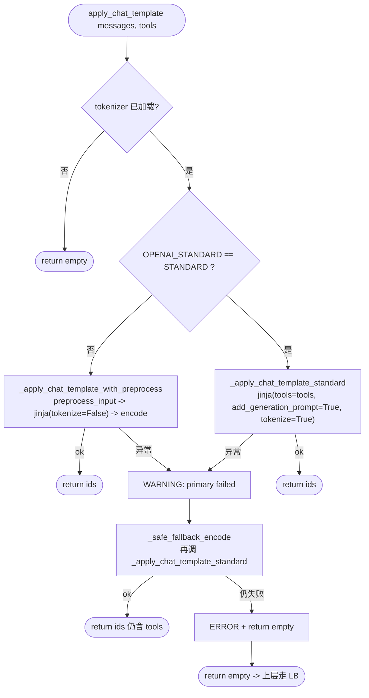
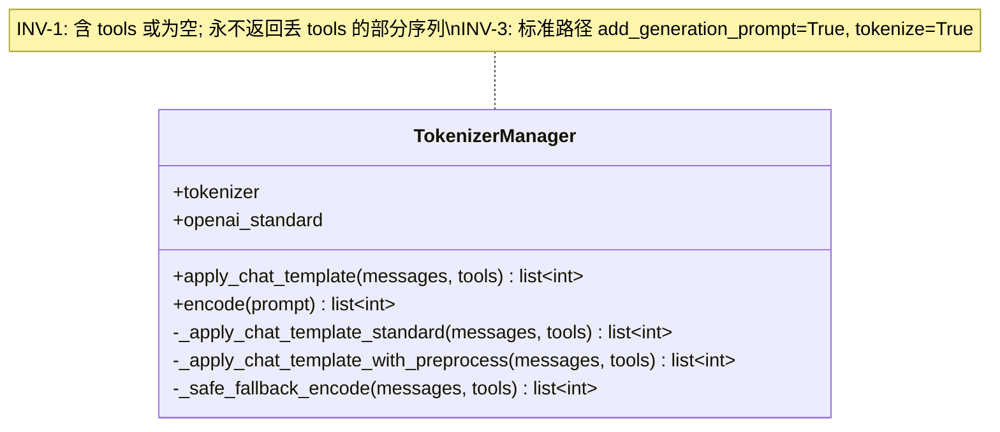
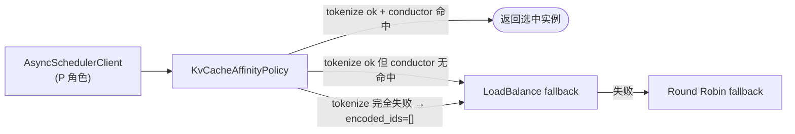
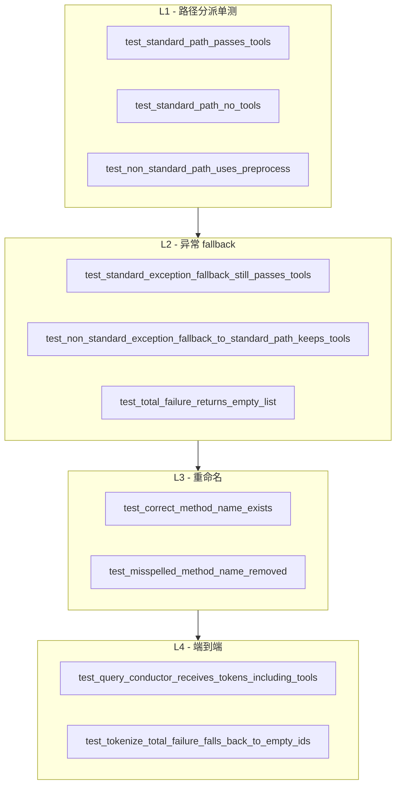
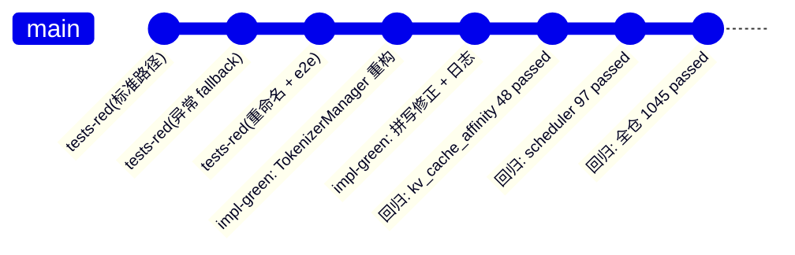

# KV-Cache 亲和性：Function-Call Tokenize 修复 详细设计

> 适用代码范围：`motor/coordinator/scheduler/policy/kv_cache_affinity.py`、
> `tests/coordinator/scheduler/test_kv_cache_affinity.py`。

---

## 1. 背景

### 1.1 原始需求

> 当前 PrefixCache 亲和性调度需要做 tokenizer，只是做了简单的 chat_template 处理，**不支持对 functioncall 做渲染**。需要对 functioncall 做模板处理，并做 tokenize。
>
> **验收标准**：functioncall 场景下，亲和性调度可正确识别 kvcache 所在节点。

### 1.2 与 vLLM Automatic Prefix Caching 的关系

vLLM 的 **APC**（Automatic Prefix Caching）只在**单实例内**生效：同实例内若两次请求 token 序列共享前缀，KV-cache 自动复用。**跨实例路由是 router/coordinator 的职责**。

vLLM 的 KV-cache key 是 **rendered token ids**，渲染流程为：

```
OpenAI Request
    ↓ chat template render（含 tools）
    ↓ tokenizer.encode
token ids
    ↓ block hash
KV cache lookup
```

因此对 function-call 而言，**只要 chat-template 正确把 `tools` 渲染进 prompt**，vLLM APC 就能命中。但前提是：

> Coordinator 端 affinity 算的 token 序列 **=** vLLM 推理端实际看到的 token 序列。

否则 conductor 给出的 `longest_matched` 与真实 KV-cache 分布脱钩，affinity 调度会错选实例。

### 1.3 修复前的代码缺陷

`TokenizerManager.apply_chat_template` 既有实现：

```python
try:
    if self.openai_standard != "STANDARD":
        return self._apply_chat_template_with_preproces(messages, tools)
except Exception as e:
    logger.warning(...)
return self.tokenizer.apply_chat_template(messages, return_dict=False)  # ← 漏 tools
```

| 分支 | 行为 |
| --- | --- |
| 标准模型路径（`OPENAI_STANDARD == "STANDARD"`） | 调 `tokenizer.apply_chat_template(messages)`，**`tools` 完全丢失** |
| 非标准模型路径 | 走 `_apply_chat_template_with_preproces` 显式带 tools，正确 |
| 非标准路径异常 | **静默退化**到标准路径，再次丢 `tools`，且**没有清晰日志** |

加上 `_apply_chat_template_with_preproces` 拼写错误（缺一个 `s`）。

线上后果：function-call 场景下，affinity 算出的 token 序列里只有 messages，没有 tools；conductor 看到的 prefix overlap 远低于真实情况，KV-cache 命中率被严重低估，验收标准不达成。

---

## 2. 设计目标

| ID | 目标 | 验收 |
| --- | --- | --- |
| G1 | 标准路径必须把 `tools` 渲染进 token 序列 | `test_standard_path_passes_tools` |
| G2 | 非标准路径保持现有 `preprocess_input` 行为 | `test_non_standard_path_uses_preprocess` |
| G3 | 任何异常 fallback 路径都**不能丢 tools** | `test_*_exception_fallback_still_passes_tools` |
| G4 | 完全失败时 fail-closed 返回 `[]`，让上层走 LB | `test_total_failure_returns_empty_list` / `test_tokenize_total_failure_falls_back_to_empty_ids` |
| G5 | 拼写修正：`_apply_chat_template_with_preprocess`，不保留旧名 alias | `test_misspelled_method_name_removed` / `test_correct_method_name_exists` |
| G6 | conductor 收到的 `encoded_ids` 真实反映 tools schema 长度 | `test_query_conductor_receives_tokens_including_tools` |
| G7 | 与 vLLM 推理端 chat-template 行为对齐：`add_generation_prompt=True` + `tokenize=True` | 直接体现在 `_apply_chat_template_standard` 的调用参数中 |

**显式不目标**（Won't）：

- 不在 Coordinator 引入新 tokenizer 实例，仍用 `TokenizerManager` 单例；
- 不改 conductor 协议（仍是 `(instances, encoded_ids)`）；
- 不引入按模型族（Qwen/Llama/DeepSeek）拆 chat-template adapter，沿用 `transformers.AutoTokenizer.apply_chat_template`。

---

## 3. 总体方案：分层兜底 tokenize 链

### 3.1 调用流程



### 3.2 关键不变量

| ID | 描述 |
| --- | --- |
| INV-1 | 任何返回的 token 序列**要么完整包含 tools**，要么为空 `[]`，**绝不返回"丢 tools 的部分序列"** |
| INV-2 | 异常路径必须打 **WARNING**（首次失败）或 **ERROR**（彻底失败）日志，**不允许静默** |
| INV-3 | 标准路径调用参数固定为 `add_generation_prompt=True, tokenize=True, return_dict=False`，与 vLLM/SGLang 推理端对齐 |
| INV-4 | 拼写错误 `_apply_chat_template_with_preproces` **彻底移除**，不保留 alias |

`INV-1` 是这次修复的**核心契约**：宁可 fail-closed 让 LB 兜底，也不能用错误的 token 序列污染 conductor 决策。

---

## 4. 修改后类与方法



| 方法 | 角色 |
| --- | --- |
| `apply_chat_template(messages, tools)` | 公共入口，负责路径分派 + 异常捕获 |
| `_apply_chat_template_standard(messages, tools)` | **新增**。标准 OpenAI 兼容模型直接调 jinja chat-template，显式传 `tools` + `add_generation_prompt=True` + `tokenize=True` |
| `_apply_chat_template_with_preprocess(messages, tools)` | **改名**（原 `_apply_chat_template_with_preproces`）。非标准模型走 `preprocess_input` → `apply_chat_template(tokenize=False)` → `encode` |
| `_safe_fallback_encode(messages, tools)` | **新增**。所有 fallback 的唯一入口；**始终带 tools 重试一次**；失败则 ERROR + 返回 `[]` |

### 4.1 调用契约

`KvCacheAffinityPolicy.select_endpoint_from_list` 拿到 `encoded_ids` 后立即记录一条 DEBUG：

```text
kv_affinity tokenize ok: msgs=%d tools=%d encoded_ids=%d
```

线上排错时只需 grep 这一行即可知道某次请求 affinity 端看到了多少 token、tools 是否被正确编码。

---

## 5. 与上层调度器协作

`KvCacheAffinityPolicy.select_endpoint_from_list` 是被 `AsyncSchedulerClient` 在 `scheduler_type=kv_cache_affinity` 时为 P 角色调用的入口。其失败兜底链：



本次修复不动这条链路本身，仅修复 `KvCacheAffinityPolicy` 内部 tokenize 路径。但有两个保证：

1. **修复前**漏 tools 时，conductor 误判，`KvCacheAffinityPolicy` 仍可能"成功"返回错误实例选择 → 用户感知到 KV-cache 命中率显著低于预期；
2. **修复后**：tokenize 完全失败时返回 `[]` → `KvCacheAffinityPolicy` 返回 None → 上层 LB 兜底。这是**期望的安全行为**，比"假成功"安全得多。

---

## 6. 失败与降级矩阵

| 场景 | 表现 | 兜底 |
| --- | --- | --- |
| `tokenizer is None`（功能未启用） | 直接返回 `[]` | LB |
| 标准路径 jinja 不支持 `tools` 参数 | 抛异常进入 fallback | `_safe_fallback_encode` 再次尝试 → 仍失败则返回 `[]` → LB |
| 非标准路径 `preprocess_input` 异常 | WARNING + fallback 走标准路径（仍带 tools） | 同上 |
| `tools=None`（普通 chat） | 标准路径以 `tools=None` 调 jinja | 行为与修复前一致 |
| `tools=[]`（空 tools） | 同上，等价于无 tools | 行为与修复前一致 |
| 全部失败 | ERROR 日志 + 返回 `[]` | LB |

---

## 7. 测试设计

### 7.1 测试金字塔



### 7.2 用例对应表

| 用例 | 校验目标 |
| --- | --- |
| `test_standard_path_passes_tools` | G1、INV-3 |
| `test_standard_path_no_tools` | 无 tools 场景兼容 |
| `test_non_standard_path_uses_preprocess` | G2 |
| `test_standard_exception_fallback_still_passes_tools` | G3、INV-1、INV-2 |
| `test_non_standard_exception_fallback_to_standard_path_keeps_tools` | G3、INV-1 |
| `test_total_failure_returns_empty_list` | G4、INV-1、INV-2 |
| `test_correct_method_name_exists` / `test_misspelled_method_name_removed` | G5、INV-4 |
| `test_query_conductor_receives_tokens_including_tools` | G6、验收标准 |
| `test_tokenize_total_failure_falls_back_to_empty_ids` | G4、与上层 LB 协作 |

### 7.3 TDD 节奏



---

## 8. 兼容性

| 维度 | 影响 |
| --- | --- |
| 配置 | 无变化 |
| 接口 | `TokenizerManager` 私有方法重命名（移除拼写错误名），无外部消费者；`apply_chat_template` 公共签名不变 |
| 日志格式 | 旧 `"arguments exchange error: {e}"` 替换为 `"kv_affinity primary tokenize path failed: ..."`，依赖该字符串告警的需要更新 |
| 调度行为 | 仅在 function-call 请求 + `OPENAI_STANDARD=STANDARD` 路径下"行为变化"——这是**期望**的修复 |
| 回滚 | 无需整体回滚；最坏情况 `_safe_fallback_encode` 自动 fail-closed，业务退到 LB |

---

## 9. 验收对齐回顾

> functioncall 场景下，亲和性调度可正确识别 kvcache 所在节点。

修复后的链路：

1. token 序列与 vLLM 一致 —— `_apply_chat_template_standard` 调用参数与 vLLM/SGLang chat-template render 对齐；
2. token 长度可观测 —— `kv_affinity tokenize ok: msgs=N tools=M encoded_ids=K` DEBUG 日志；
3. conductor 决策真实化 —— 修复前 `longest_matched` 不含 tools，修复后含 tools，能区分"哪台实例真正缓存了这套工具"；
4. 失败兜底安全 —— fail-closed `[]`，让上层 LB 兜底，绝不污染 conductor。

---

## 10. 相关代码文件

| 文件 | 角色 |
| --- | --- |
| `motor/coordinator/scheduler/policy/kv_cache_affinity.py` | 本次修复主体 |
| `tests/coordinator/scheduler/test_kv_cache_affinity.py` | 测试新增 / 升级 |
| `motor/coordinator/scheduler/policy/utils.py` | `preprocess_input` 等模板预处理（不动） |
