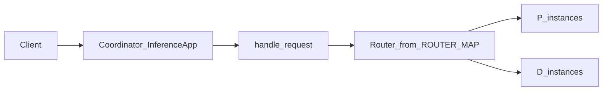

# PD 分离（特性说明）

**Prefill / Decode 分离**指将推理的预填充与解码阶段调度到不同实例（P/D 角色）协同完成。业务含义与部署时的 `user_config.json`、KV 传输等配置，见用户指南中的 [PD 分离服务部署](../user_guide/service_deployment/pd_disaggregation_deployment.md)。

本节仅从**本仓库 Coordinator 运行时代码**说明：部署模式如何枚举、入口请求如何选路由实现。

## 部署模式枚举

`motor/config/coordinator.py` 中 `DeployMode` 取值包括：

| 枚举成员 | 字符串值 |
|----------|-----------|
| `SINGLE_NODE` | `single_node` |
| `PD_SEPARATE` | `pd_separate` |
| `CDP_SEPARATE` | `cdp_separate` |
| `CPCD_SEPARATE` | `cpcd_separate` |
| `PD_DUAL_DISPATCH` | `pd_dual_dispatch` |
| `PD_DISAGGREGATION_SINGLE_CONTAINER` | `pd_disaggregation_single_container` |

配置由 `CoordinatorConfig` / `SchedulerConfig` 的 `deploy_mode` 字段驱动（与部署文档中的 scheduler 配置一致处以该文档为准）。

## 主请求路由表

`motor/coordinator/router/dispatch.py` 中 `_ROUTER_MAP` 将 `DeployMode` 映射到具体 Router 类：

| `DeployMode` | Router 类 |
|----------------|------------|
| `CDP_SEPARATE` | `SeparateCDPRouter` |
| `PD_SEPARATE` | `SeparateCDPRouter` |
| `CPCD_SEPARATE` | `SeparatePDRouter` |
| `SINGLE_NODE` | `PDHybridRouter` |
| `PD_DISAGGREGATION_SINGLE_CONTAINER` | `SeparateCDPRouter` |
| `PD_DUAL_DISPATCH` | `SeparatePDDualDispatchRouter` |

客户端推理请求经 `handle_request` 构造 `RequestInfo` 后，实例化上表中的类并调用 `handle_request()`。

## 实例就绪与回退

`motor/coordinator/domain/scheduling.py` 定义 `InstanceReadiness`（如 `REQUIRED_MET`、`ONLY_PREFILL`、`ONLY_DECODE`、`NONE`、`UNKNOWN`）。

`handle_request` 中逻辑（与源码一致）：

- 读取 `config_mode = config.scheduler_config.deploy_mode` 与 `readiness = await scheduler.has_required_instances()`。
- 当 `config_mode` 为 `PD_SEPARATE`、`CDP_SEPARATE`、`CPCD_SEPARATE` 或 `PD_DISAGGREGATION_SINGLE_CONTAINER`，且 `readiness == ONLY_PREFILL` 时，将实际用于查表的 `deploy_mode` 设为 `DeployMode.SINGLE_NODE`（注释说明：仅在仅有 P、没有 D 时回退）。
- 否则 `deploy_mode` 等于 `config_mode`。
- 再用 `deploy_mode` 从 `_ROUTER_MAP` 取类；若取不到则返回 500，`detail` 含 `Unknown deploy mode`。

## 数据流（概念）

Metaserver 路径（Decode 侧将 prefill 请求转到 Worker 上的入口）见 [面向服务接口说明](../user_guide/service_oriented_interface/description.md) 中与 `POST /v1/metaserver` 相关的说明；实现入口为 `dispatch.handle_metaserver_request` 与 `SeparateCDPRouter.handle_metaserver_request`。
