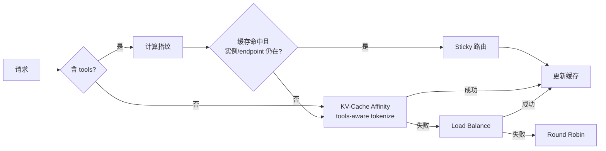

# Function Call 亲和性调度（特性说明）

**Function Call 亲和性调度**针对 LLM Agent / Function-Call 工作负载，通过两层叠加保证 KV-cache 复用率：

1. **L1：tools 指纹 sticky 路由**（`function_call_affinity` 策略）—— 同 `tools` 的请求粘到上次成功路由到的实例/endpoint，O(1)，无需 conductor / tokenizer。
2. **L2：tools-aware token-level KV-cache 亲和**（`kv_cache_affinity` 策略）—— affinity 端 tokenize 算出的 token 序列**与 vLLM 实际推理时一致**，conductor 的最长前缀匹配长度真实反映 KV-cache 分布。

详细设计文档：

- L1：[开发者指南 - Function Call 亲和性调度详细设计](../developer_guide/function_call_affinity/function_call_affinity_design.md)
- L2：[开发者指南 - KV-Cache 亲和性 Function-Call Tokenize 修复](../developer_guide/kv_cache_affinity/tools_aware_tokenize_design.md)

## 调度策略枚举

`motor/config/coordinator.py` 中 `SchedulerType` 取值：

| 枚举成员 | 字符串值 |
| --- | --- |
| `LOAD_BALANCE` | `load_balance` |
| `ROUND_ROBIN` | `round_robin` |
| `KV_CACHE_AFFINITY` | `kv_cache_affinity` |
| `FUNCTION_CALL_AFFINITY` | `function_call_affinity` |

启用方式：在 coordinator 的 `scheduler_config.scheduler_type` 中配置 `function_call_affinity`，与已有 `kv_cache_affinity` 启用方式一致。

## 选择优先级

## 与 `kv_cache_affinity` 的关系

`function_call_affinity` 是 `kv_cache_affinity` 的**严格超集**：在 KV 路径之上叠加了一层基于 tools 指纹的 sticky 缓存。当请求没有 `tools` 字段时，行为与 `kv_cache_affinity` 完全一致；当存在 `tools` 时优先尝试 sticky，失败再退化为 KV → LB → RR。

`kv_cache_affinity` 自身已经支持 function-call：`TokenizerManager.apply_chat_template` 会把 `tools` 渲染进 token 序列后再交给 conductor 做最长前缀匹配。即使不启用 L1 sticky，仅启用 `kv_cache_affinity`，function-call 场景也能正确识别 KV-cache 所在节点。

## 兼容性

- `SchedulerType` 仅新增枚举值，未启用时所有现有路径行为不变。
- 不引入对 conductor / tokenizer 的新依赖；当它们不可用时本策略仍可用。
- 客户端无需修改，启用仅修改 coordinator 侧 scheduler 配置。
