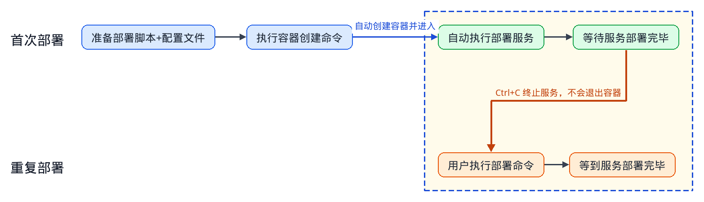

# 基于Docker的单容器服务部署指导

本文档指导用户**基于Docker在单机上完成推理服务的部署**，一台服务器、一个容器内完成整个PD分离的部署，适用于小模型（权重小于100GB）场景，不依赖 K8s。大模型或多机部署可参见 [多容器部署指导](multi_container.md)。KV 池化需要单独的 kv_store 容器，请使用多容器部署并参见 [开启 KV 池化](multi_container.md#开启-kv-池化可选)。

## 部署流程示意图



## 镜像准备

通过以下方式获取镜像，并加载到本机：

 - **方式一**：下载官方完整的 MindIE Motor 镜像
     进入 [昇腾官方镜像仓库](https://www.hiascend.com/developer/ascendhub)，搜索 `motor`，按设备型号选择对应 MindIE Motor 镜像。
 - **方式二**：在已有镜像中安装 MindIE Motor
     基础镜像已安装 CANN、vLLM、vLLM Ascend 等组件，可参考 [从 vLLM Ascend 构建 MindIE Motor 镜像](../../maintenance/build_motor_image_from_vllm_ascend.md#基于vllm-ascendsglang镜像安装mindie-motor) 额外安装 MindIE Motor。

获取镜像后，请使用以下命令将镜像加载至服务器：

   ```bash
   docker load -i xxxx.tar
   ```

待镜像导入后，请使用以下命令查看Docker镜像是否存在：

   ```bash
   docker images
   ```

## 准备服务启动脚本

   获取服务部署脚本`examples` 目录：

   - 方式一（使用**官方完整 MindIE Motor 镜像**）：镜像内路径为 `/tmp/motor/examples`，可执行以下命令：

     ```bash
     IMAGE="<镜像名或镜像ID>"
     cid=$(docker create "$IMAGE")
     docker cp "$cid:/tmp/motor/examples" ./examples
     docker rm "$cid"
     ```

   - 方式二：（使用**手动安装 MindIE-Motor 的镜像**）：`git clone` 代码仓后，启动脚本位于 `MindIE-Motor/examples` 目录。

## 配置服务化参数

1. **准备配置文件**

   MindIE Motor已提供常用模型（deepseek_v4_flash、deepseek_v4_pro、GLM 5.1等）的[**PD分离配置示例**](https://gitcode.com/Ascend/MindIE-Motor/blob/master/examples/infer_engines/vllm/models/README.md)，**用户修改少量配置后可直接使用**。

   对于未提供典型配置的模型，可参考 [MindIE Motor 配置自动生成指导](https://gitcode.com/Ascend/MindIE-Motor/blob/master/examples/infer_engines/vllm/models/README.md)，自动生成配置文件 `user_config.json` 与 `env.json`。

2. **配置端口与部署模式**

   单容器里管理面和推理进程共用 host 网络，需要改部署模式并错开端口，否则会冲突：

   ```json
   {
     "motor_deploy_config": {
       "deploy_mode": "single_container",
       ...
     },
     ...
     "motor_controller_config": {
       "api_config": {
         "controller_api_port": 2026,
         "observability_api_port": 2027
       }
     },
     ...
     "motor_engine_prefill_config": {
       "motor_nodemanger_config": {
         "api_config": { "node_manager_port": 3026 }
       },
       ...
     },
     "motor_engine_decode_config": {
       "motor_nodemanger_config": {
         "api_config": { "node_manager_port": 4026 }
       },
       ...
     }
   }
   ```

   `deploy_mode` 必须为 `single_container`。

3. **同步启动脚本配置**

    将准备好的配置文件（user_config.json、env.json）存放于启动脚本的examples/infer_engines/vllm目录下。

## 启动服务

在本机 `examples/deployer` 目录下执行以下命令：

```bash
python3 docker_deploy.py --config_dir ../infer_engines/vllm \
  --container-name motor-single --devices 0,1 \
  --pod-ip <本机 IP地址> --nic-name <本机主网卡名称>
```

上述命令执行后，窗口将自动**创建容器**、**进入容器**以及**启动服务**，用户在**屏幕上可观察到日志打印**。`--devices` 需覆盖 Prefill 和 Decode 使用的卡。

**启动参数说明**

| 参数 | 说明 |
| :--- | :--- |
| `--config_dir` | `user_config.json` 和 `env.json` 所在目录。 |
| `--container-name` | 容器名，可自定义。 |
| `--devices` | 本容器挂载的 NPU 卡号，如 `0,1`。如不填写，默认挂载服务器所有卡。 |
| `--pod-ip` | **当前服务器**的 IP。 |
| `--nic-name` | **当前服务器**对应 `--pod-ip` 的网卡名。 |

执行以下命令可以查看网卡名和本机 IP。`dev` 后面是 `--nic-name`，`src` 后面是 `--pod-ip`。

```bash
ip -4 route get 1.1.1.1
```

## 推理验证

在本机发送如下推理请求，即可进行推理验证：

```bash
curl -X POST http://127.0.0.1:1025/v1/chat/completions \
  -H "Content-Type: application/json" \
  -d '{
    "model": "<模型名称，必须和user_config.json文件中的配置一致>",
    "messages": [{"role": "user", "content": "who are you?"}],
    "max_tokens": 36,
    "stream": true
  }'
```

若返回以下内容，则表示服务尚未就绪，可稍后重试。

```json
{"detail":"Service is not available"}
```

## 终止服务与重复部署

在终端执行 **Ctrl+C** 可终止服务，但不会退出容器。服务终止后会出现如下提示，便于用户重新部署。

```text
容器内服务已终止，可执行以下命令重新部署服务。
python3 /path/to/examples/deployer/docker_deploy.py --config_dir /path/to/examples/infer_engines/vllm --start --container-name motor-single --pod-ip <本机 IP地址> --nic-name <本机主网卡名称>
运行日志：examples/motor_workspace/motor-single/single/log/docker-single-<时间戳>.log
```

用户可直接复制上述指令重新部署服务。
