# 在 MindIE Motor 中部署 UCM

[Unified Cache Manager（UCM）](https://github.com/ModelEngine-Group/unified-cache-management) 通过持久化和复用 KVCache，减少相同前缀的重复 Prefill 计算。MindIE Motor 当前接入的是 **UCM Prefix Cache**。

在分布式 PD 部署中，Prefill 使用 `MultiConnector[Mooncake 传输 Connector, UCMConnector]`：Mooncake 负责 P/D 实时 KV 传输，UCM 负责跨请求前缀复用；Decode 使用与 Prefill 匹配的 Mooncake Connector。



> [!IMPORTANT]UCM 不是 `AscendStoreConnector` 的 backend
>
> 不要配置 `"backend": "ucm"`。用于 P/D 传输的 Mooncake Connector 位于 `connectors[0]`，`UCMConnector` 位于 `connectors[1]`。Mooncake Connector 的具体类型由 PD 方案决定，并不限定为 `MooncakeConnectorV1`。

完整样例位于 `examples/infer_engines/vllm/ucm_pd/`。

## 准备 UCM

获取与当前 Python、CANN、硬件和 vLLM-Ascend 版本匹配的 UCM wheel，并放到 Engine Pod 可访问的目录。下面以模型挂载目录中的 `/mnt/weight/packages/uc_manager-*.whl` 为例。

在 `examples/deployer/startup/boot.sh` 中，紧跟 `source "$SCRIPT_DIR/common.sh"` 加入：

```bash
if [ "$ROLE" = "prefill" ]; then
    python3 -m pip install /mnt/weight/packages/uc_manager-*.whl
fi
```

`boot.sh` 会在 Engine Pod 启动时执行；这里只为 Prefill 安装 UCM，因为 Decode 不加载 `UCMConnector`。请确保通配符只匹配一个 wheel。

## 修改 `user_config.json`

复制 `examples/infer_engines/vllm/ucm_pd/user_config.json`，再按实际环境修改下面几部分。

### 配置 UCM 存储

通过 `motor_deploy_config.storage` 将缓存目录挂载到 Engine Pod，同时通过 `dshm_size` 为 Cache Store 配置 `/dev/shm`：

#### 使用 StorageClass 动态创建 PVC

```json
"motor_deploy_config": {
  "image_name": "<MindIE Motor vLLM 推理镜像>",
  "weight_mount_path": "/mnt/weight/",
  "storage": [
    {
      "type": "pvc",
      "storage_class_name": "<支持 RWX 的 StorageClass>",
      "access_mode": "ReadWriteMany",
      "size": "512Gi",
      "mount_path": "/mnt/ucm"
    }
  ],
  "dshm_size": "128Gi"
}
```

也可以将 `storage` 替换为下面任一种配置。

#### 挂载已有 PVC

PVC 必须已经存在于 `job_id` 对应的命名空间中。使用 `claim_name` 时，不要再配置 `storage_class_name`、`size` 或 `access_mode`：

```json
"storage": [
  {
    "type": "pvc",
    "claim_name": "<已有的 RWX PVC 名称>",
    "mount_path": "/mnt/ucm"
  }
]
```

#### 直接挂载 NFS

NFS 不依赖 StorageClass 或 PVC，所有 Engine Pod 通过相同的 `server` 和 `path` 访问共享目录：

```json
"storage": [
  {
    "type": "nfs",
    "server": "192.168.10.100",
    "path": "/export/ucm",
    "mount_path": "/mnt/ucm",
    "read_only": false
  }
]
```

#### 挂载 HostPath

HostPath 将节点上的目录直接挂入 Engine Pod：

```json
"storage": [
  {
    "type": "hostpath",
    "path": "/mnt/ucm",
    "mount_path": "/mnt/ucm",
    "host_path_type": "DirectoryOrCreate",
    "read_only": false
  }
]
```

HostPath 默认只在当前节点可见。多节点部署应优先使用 RWX PVC 或 NFS；只有各节点的同一路径已经挂载同一个共享文件系统时，HostPath 才能跨节点复用。

UCM 配置中的 `storage_backends` 必须与这里的 `mount_path` 完全一致；`dshm_size` 应大于 Pod 内 Cache Store 使用的 `cache_buffer_capacity_gb` 并预留运行余量。

### 配置 Mooncake master

根节点的 `kv_cache_store_config` 为 Mooncake P/D 传输提供配套服务，不是 UCM 的持久化 Store：

```json
"kv_cache_store_config": {
  "backend": "mooncake",
  "port": 50088,
  "eviction_high_watermark_ratio": 0.9,
  "eviction_ratio": 0.1
}
```

### 配置 Prefill

Prefill 的 `kv_transfer_config` 使用 `MultiConnector`，并将 UCM 配置内联到 `UCMConnector`。以下沿用 `ucm_pd` 样例中的 `MooncakeConnectorV1`：

```json
"kv_transfer_config": {
  "kv_connector": "MultiConnector",
  "kv_role": "kv_producer",
  "kv_connector_extra_config": {
    "connectors": [
      {
        "kv_connector": "MooncakeConnectorV1",
        "kv_role": "kv_producer",
        "kv_port": "20001",
        "kv_connector_extra_config": {
          "prefill": { "dp_size": 1, "tp_size": 2 },
          "decode": { "dp_size": 1, "tp_size": 2 }
        }
      },
      {
        "kv_connector": "UCMConnector",
        "kv_role": "kv_both",
        "kv_connector_module_path": "ucm.integration.vllm.ucm_connector",
        "kv_connector_extra_config": {
          "ucm_connectors": [
            {
              "ucm_connector_name": "UcmPipelineStore",
              "ucm_connector_config": {
                "store_pipeline": "Cache|Posix",
                "storage_backends": "/mnt/ucm",
                "cache_buffer_capacity_gb": 64,
                "posix_capacity_gb": 400
              }
            }
          ],
          "enable_event_sync": true,
          "use_layerwise": true
        }
      }
    ]
  }
}
```

其中 `storage_backends: "/mnt/ucm"` 对应前面的 `storage[].mount_path`，`posix_capacity_gb` 应小于存储卷的实际可用容量。

`connectors[0]` 也可以按 PD 方案使用 MindIE Motor 当前已识别的其他 Mooncake 传输 Connector，例如 `MooncakeHybridConnector` 或 `MooncakeLayerwiseConnector`。不同 Connector 的执行模式和参数并不相同，应按 [PD 分离特性说明](../../../../design/pd_disaggregation.md#connector-驱动执行计划) 配置，并保证 Prefill 与 Decode 使用相互匹配的传输配置；`UCMConnector` 仍保持在 `connectors[1]`。

### 配置 Decode

Decode 使用与 Prefill 匹配的 Mooncake Connector，不配置 UCM。以下是 `MooncakeConnectorV1` 样例：

```json
"kv_transfer_config": {
  "kv_connector": "MooncakeConnectorV1",
  "kv_role": "kv_consumer",
  "kv_port": "20001",
  "kv_connector_extra_config": {
    "prefill": { "dp_size": 1, "tp_size": 2 },
    "decode": { "dp_size": 1, "tp_size": 2 }
  }
}
```

本例中 Prefill 与 Decode 的 `kv_port`、`dp_size` 和 `tp_size` 应保持对应一致。使用其他 Mooncake Connector 时，按对应 Connector 的要求配置两端参数。

## 部署和删除

在 `examples/deployer` 目录执行一句命令完成部署：

```bash
python3 deploy.py --config_dir ../infer_engines/vllm/ucm_pd
```

使用 `user_config.json` 中的 `job_id` 作为命名空间，一句命令删除部署：

```bash
bash delete.sh mindie-motor
```

## 验证 UCM 命中


向 Coordinator 连续发送两次完全相同的长前缀请求即可。第二次请求应复用第一次请求写入的 KVCache：

```bash
curl -sS http://<节点 IP>:31015/v1/chat/completions \
  -H 'Content-Type: application/json' -d @long-request.json
curl -sS http://<节点 IP>:31015/v1/chat/completions \
  -H 'Content-Type: application/json' -d @long-request.json
```

筛出 Prefill Pod 并 grep UCM 命中日志：

```bash
PREFILL_POD=$(kubectl -n mindie-motor get pods -o name | grep '/vllm-p' | head -n 1)
kubectl -n mindie-motor logs "$PREFILL_POD" --since=10m | \
  grep -E 'hit hbm|hit external'
```

第二次请求对应日志中的 `hit hbm` 或 `hit external` 应为非零；如果有多个 Prefill Pod，应分别检查各 Pod 日志。

## 常见问题

| 现象 | 检查项 |
| --- | --- |
| Prefill 无法导入 `ucm` | 检查 `boot.sh` 中的 wheel 路径，以及 wheel 与 Python/CANN/硬件版本是否匹配 |
| `UCMConnector must be connectors[1]` | 保持 Mooncake 传输 Connector 为 `connectors[0]`、UCM 为 `connectors[1]` |
| `/mnt/ucm` 不可写 | 检查 `storage[].mount_path`、PVC/NFS 权限和 `storage_backends` |
| 第二次请求仍未命中 | 确认两次请求前缀完全一致，并检查所有 Prefill Pod 日志 |

## 相关资料

- [UCM vLLM-Ascend 快速开始](https://ucm.readthedocs.io/en/latest/getting-started/quickstart_vllm_ascend.html)
- [UCM PipelineStore](https://ucm.readthedocs.io/en/latest/user-guide/prefix-cache/pipeline_store.html)
